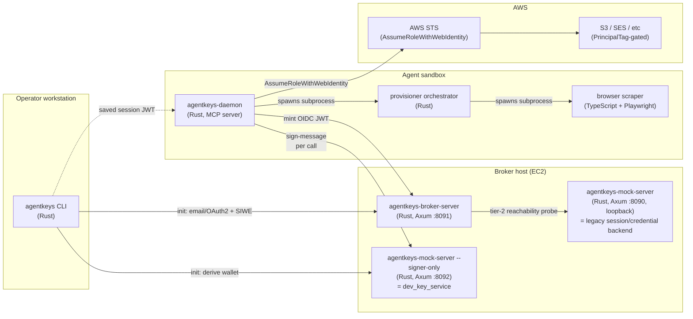
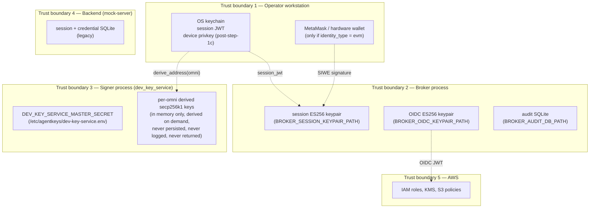
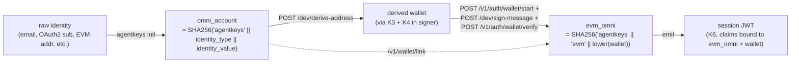
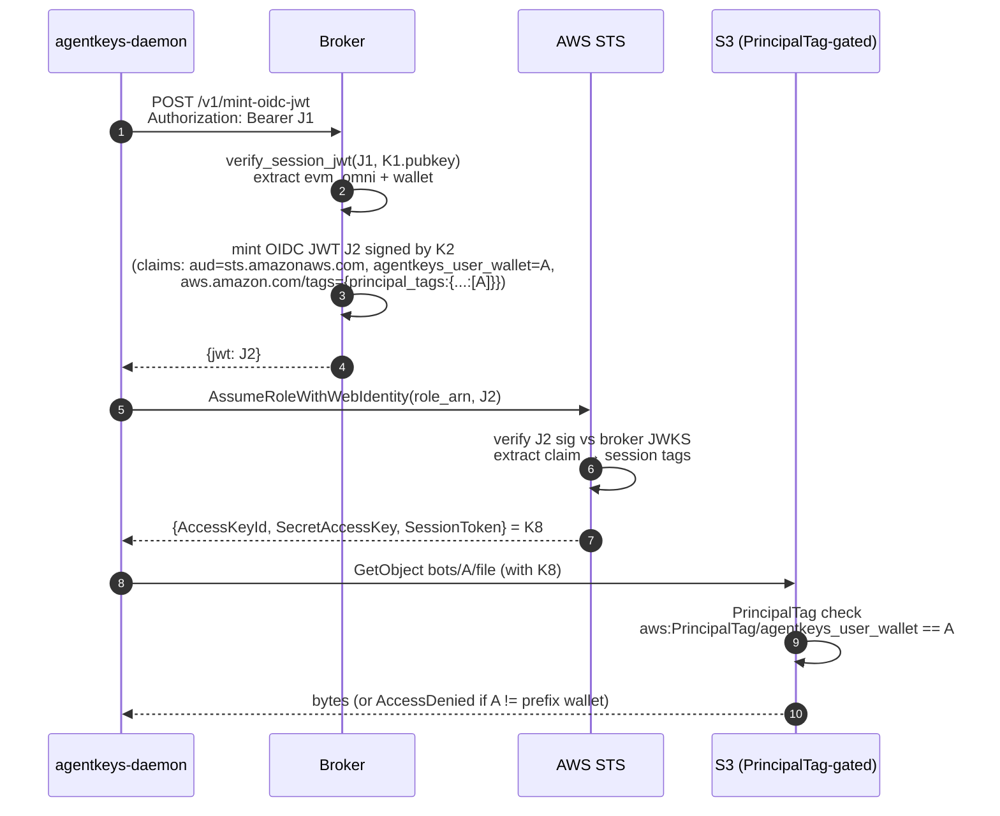
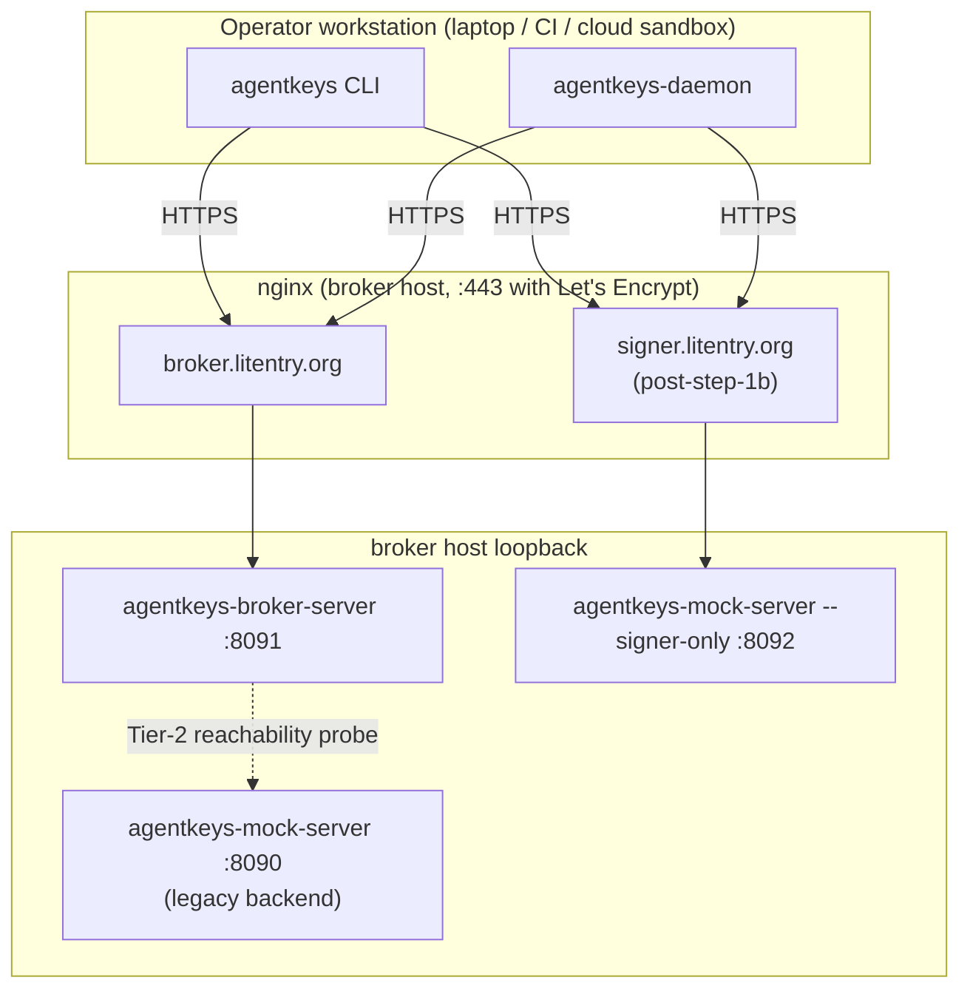

# AgentKeys — Architecture (broker, signer, daemon, key flows)

**Audience:** anyone who needs to reason about AgentKeys end-to-end —
new contributors, security reviewers, ops, design partners. Use this
as the single visual + textual reference. Diagrams are Mermaid where
possible so they render in GitHub and copy cleanly into Figma.

**Status:** canonical (post-issue-#74). Supersedes `docs/stage7-wip.md`
(archived). Component inventory and language choices were absorbed
from the prior `architecture.md` revision.

**Companion docs (canonical for their narrow surface; this doc links
to them rather than duplicating):**

- [`signer-protocol.md`](signer-protocol.md) — `/dev/*` wire contract
- [`threat-model-key-custody.md`](threat-model-key-custody.md) —
  retroactive-confidentiality + key custody position
- [`heima-gaps-vs-desired-architecture.md`](heima-gaps-vs-desired-architecture.md)
  — what current-Heima is missing vs the desired AgentKeys
  architecture
- [`credential-backend-interface.md`](credential-backend-interface.md)
  — 15-method `CredentialBackend` trait
- [`plans/issue-74-dev-key-service-plan.md`](plans/issue-74-dev-key-service-plan.md)
  — dev_key_service signer (issue #74 step 1)
- [`plans/issue-74-step-1c-device-key-auth.md`](plans/issue-74-step-1c-device-key-auth.md)
  — device-key auth on `/dev/*` (issue #74 step 1c, planned)

---

## 1. Component map



**Three independent trust boundaries, three independent products:**

| Service | Public hostname (typical) | Holds | Role |
|---|---|---|---|
| Broker | `broker.litentry.org` | ES256 OIDC keypair, ES256 session keypair, audit DB | Mints session JWTs after identity ceremony; mints OIDC JWTs from session JWTs; never holds AWS principals at runtime |
| Signer (`dev_key_service`) | `signer.litentry.org` (post-step-1b) | `DEV_KEY_SERVICE_MASTER_SECRET` (32 bytes hex) | Derives EVM wallets from `omni_account` and signs EIP-191 messages on the operator's behalf. Replaceable with a TEE worker post-step-2. |
| Backend (mock-server) | `127.0.0.1:8090` (loopback only) | Legacy session/credential SQLite | Tier-2 reachability target for the broker; legacy `/session/*` + `/credential/*` endpoints used by the daemon's pair-flow |

**Why three?** Compromise of any one process must NOT enable
impersonating the others. Broker compromise can't extract the master
secret (it's on the signer). Signer compromise can't mint session
JWTs (the keypair is on the broker). Backend compromise can't sign
EVM messages and can't mint cloud creds. The split is enforced by
process boundary and (at production deployment) by separate listener
+ host firewall.

---

## 2. Trust boundaries (where keys live, who can see them)



**Compromise-blast-radius table:**

| Boundary breached | What attacker gains | What they CANNOT do |
|---|---|---|
| Operator workstation | Stolen session JWT (replay until exp); stolen device key (post-step-1c, sign on operator's behalf until rotation) | Cannot derive wallets for other operators; cannot mint session JWTs for new identities |
| Broker process | Mint session JWTs for any omni; mint OIDC JWTs (gated by JWT auth, defeated by full broker compromise) | Cannot derive wallets; cannot sign EIP-191 messages; cannot AssumeRole (no AWS principal at broker) |
| Signer process (current step-1) | Derive any wallet from any omni; sign any EIP-191 message for any omni | Cannot mint session JWTs; cannot mint OIDC JWTs; cannot reach AWS |
| Signer process (post-step-1c) | Above, AND can verify (but not forge) device-signed requests | Same as above; per-request device signatures still gate the call surface |
| Backend (mock-server) | Stale legacy session bearer; credential ciphertext (today's mock storage) | Cannot affect Stage 7 mint paths (broker verifies session JWTs locally post-issue-#71) |
| AWS account | Game over for that operator's data scope | None of the above; AWS compromise is its own incident class |

**Note on signer-process compromise.** Today's `dev_key_service` is
the **dev-stage** placeholder. Compromising the signer host = full
master-secret leak = every wallet for every operator is forge-able
forever. The TEE worker (issue #74 step 2) closes this: master secret
is sealed inside the enclave; host root no longer suffices.
Step-1c device-key auth additionally bounds the impact of broker
compromise on the signer call surface.

---

## 3. Key inventory

The complete list of cryptographic material in the system. Use this
as the source-of-truth when designing the Figma trust-flow diagram.

| # | Key | Type | Lives in | Role | Lifecycle |
|---|---|---|---|---|---|
| K1 | Broker session keypair | ES256 (P-256) | Broker process; pinned file at `BROKER_SESSION_KEYPAIR_PATH` (mode 0600); pubkey exported to `*.pub.pem` (mode 0644) for signer | Signs session JWTs (issued post-identity-ceremony, bound to omni + wallet) | Generated at first broker boot; preserved across re-deploys; manual rotation procedure TBD |
| K2 | Broker OIDC keypair | ES256 (P-256) | Broker process; pinned file at `BROKER_OIDC_KEYPAIR_PATH` (mode 0600); pubkey published at `<broker>/.well-known/jwks.json` | Signs OIDC JWTs minted by `/v1/mint-oidc-jwt` (consumed by AWS STS / GCP WIF / Tencent CAM via `AssumeRoleWithWebIdentity`) | Generated at first broker boot; rotation requires re-registering the OIDC provider in cloud IAM |
| K3 | Dev-signer master secret | 32 raw bytes (hex-encoded) | `/etc/agentkeys/dev-key-service.env` (mode 0600, owner agentkeys); auto-generated by `setup-broker-host.sh` | HKDF input for deriving per-omni secp256k1 wallets | Generated once on first broker-host setup; **never rotate** (rotation invalidates every previously-derived wallet); replaced by sealed enclave secret post-step-2 |
| K4 | Per-omni derived wallet | secp256k1 | Signer process (in memory only, derived on demand from K3 + omni; never persisted, never logged, never returned over wire) | The "managed EVM wallet" for an operator who authenticated via email/OAuth2/passkey — used by signer to sign EIP-191 messages on operator's behalf | Deterministic; same `(K3, omni)` always → same wallet; lifecycle == lifecycle of K3 |
| K5 | EVM-wallet (operator-held) | secp256k1 | Operator's MetaMask / hardware wallet / `cast wallet` | Identity authenticator for `identity_type = evm`; signs SIWE messages directly (this path bypasses K3/K4 entirely) | Operator-managed; outside AgentKeys' lifecycle |
| K6 | Session JWT | JWT (ES256 by K1) | Operator's OS keychain (via `agentkeys-core::session_store`) on the workstation; in daemon memory at runtime | Bearer credential for `/v1/mint-oidc-jwt`, `/v1/wallet/*`, post-step-1b also for `/dev/*` | TTL = `BROKER_SESSION_JWT_TTL_SECONDS` (default 18000s = 5h); re-mint requires re-running the identity ceremony |
| K7 | OIDC JWT | JWT (ES256 by K2) | Daemon memory only (transient — fetched per mint) | Web-identity token for `AssumeRoleWithWebIdentity` against AWS STS | TTL = `BROKER_OIDC_JWT_TTL_SECONDS` (bounded `[60, 3600]`, default 300s) |
| K8 | AWS temp credentials | STS access key + secret + session token | Daemon memory only (transient — refetched per provision/mint) | Direct AWS API access scoped by PrincipalTag = wallet | 1-hour TTL (STS default); short by design |
| K9 | DKIM keypair (per outbound domain) | Ed25519 | Stage 6 design — currently TEE-only, not yet implemented | **DKIM = DomainKeys Identified Mail (RFC 6376).** A per-domain signing key used to sign outbound email headers; the matching public key is published as a DNS TXT record at `<selector>._domainkey.<domain>`. Receiving mail servers fetch the pubkey via DNS, verify the signature, and use the result to decide whether the message originated from a server authorized for that domain — input to spam filtering, deliverability, and brand-impersonation defense. AgentKeys needs K9 because Stage 6 sends mail FROM operator-controlled sub-domains (e.g. for OpenRouter signups via plus-aliased addresses) and we hold the signing key ourselves rather than delegating to SES (so AWS never sees the plaintext content) — see [`heima-gaps §4`](heima-gaps-vs-desired-architecture.md). | TBD per Stage 6 spec ([`heima-gaps §4`](heima-gaps-vs-desired-architecture.md)) |
| K10 | Device key (planned, step-1c) | secp256k1 | Operator's OS keychain (per workstation, not per identity); pubkey registered at the broker as a session JWT claim | Per-request signature on `/dev/sign-message` calls — eliminates broker-as-SPOF for signer auth | Generated at `agentkeys init`; bound to a session JWT; rotated by re-init; TTL = session JWT TTL |

**Notation throughout the rest of this doc:** the K1–K10 indices
above are referenced directly so any flow can be unambiguously
mapped back to which key signed/verified/wrapped what.

---

## 4. Identity model



**Two omnis per operator, both correct, both load-bearing:**

- **Identity omni** (`OMNI`) — derived from the user's authenticator
  (email, OAuth2 sub, etc.). The signer uses this to derive the
  managed wallet. The operator's CLI/daemon uses this to call
  `/dev/sign-message`.
- **EVM omni** (`EVM_OMNI`) — derived from the **derived wallet
  address**. The session JWT is bound to this; the broker stamps
  audit rows under it; the OIDC JWT carries it as
  `agentkeys_user_wallet`.

The identity omni and the EVM omni are linked at the broker via
`POST /v1/wallet/link` so any linked identity can recover the same
EVM omni.

For an operator who authenticates with `identity_type = evm` (their
own wallet via SIWE, no dev_key_service involvement), the two omnis
are independent: identity omni = `("evm", their_real_wallet)`, EVM
omni = `("evm", their_real_wallet)`. They are equal in this case
because the user's identity IS their wallet.

---

## 5. Cold-start (init) sequence

The init flow has two halves: an **identity ceremony** (proves the
operator owns an authenticator: email, OAuth2 sub, EVM wallet, etc.)
and a **wallet binding** (signer derives the EVM wallet from the
identity-omni; broker links the wallet to the omni; SIWE round-trip
mints the long-lived EVM-omni session JWT). Step 1c (planned) puts
device-key generation **before** the identity ceremony so the
ceremony can bind the device pubkey atomically — same trust shape
as a WebAuthn credential creation ceremony.

```mermaid
sequenceDiagram
  autonumber
  participant Op as Operator
  participant CLI as agentkeys CLI
  participant KC as OS Keychain
  participant Brk as Broker
  participant Sig as Signer (dev_key_service)

  Note over CLI,KC: Step 0 — generate device keypair LOCALLY (post-step-1c)
  Op->>CLI: agentkeys init --email alice@x.com --broker-url B --signer-url S
  CLI->>CLI: generate device keypair (D_priv, D_pub); persist D_priv in KC
  CLI->>CLI: sign request payload {email, D_pub} with D_priv (proof of possession — Q7)

  Note over CLI,Brk: Step 1 — identity ceremony (binds D_pub atomically)
  CLI->>Brk: POST /v1/auth/email/request {email, device_pubkey: D_pub, pop_sig}
  Brk->>Brk: verify pop_sig against D_pub (proves CLI holds D_priv)
  Brk->>Brk: store (request_id, email, D_pub, expiry)
  Brk-->>CLI: {request_id, status: "sent"}
  Note over Brk,Op: Magic link emailed: https://broker/.../landing/<id>?device=D_pub
  Op-->>Brk: GET /v1/auth/email/landing/<id>?device=D_pub
  Brk->>Brk: confirm ?device matches stored D_pub (defends link-forwarding swap)
  loop poll
    CLI->>Brk: GET /v1/auth/email/status/<id>
    Brk-->>CLI: {status: "verified", session_jwt: J0, omni_account: O_id}
  end
  Note right of Brk: J0 carries claim agentkeys_device_pubkey = D_pub

  Note over CLI,Sig: Step 2 — wallet binding (signer is a pure RPC dependency)
  CLI->>Sig: POST /dev/derive-address {O_id}<br/>Authorization: Bearer J0
  Sig->>Sig: verify J0 against broker pubkey; HKDF(K3, O_id) → K4_priv → addr A
  Sig-->>CLI: {address: A, key_version: 1}
  CLI->>Brk: POST /v1/wallet/link {evm, A}<br/>Authorization: Bearer J0
  Brk-->>CLI: 200 (links O_id ↔ A)

  Note over CLI,Brk: Step 3 — SIWE round-trip mints the EVM-omni session JWT
  CLI->>Brk: POST /v1/auth/wallet/start {address: A}
  Brk-->>CLI: {request_id, siwe_message: M}
  CLI->>Sig: POST /dev/sign-message {O_id, message_hex: hex(M)}<br/>Authorization: Bearer J0
  Sig->>Sig: derive K4_priv from O_id; sign EIP-191(M) → sig
  Sig-->>CLI: {signature: sig, address: A}
  CLI->>Brk: POST /v1/auth/wallet/verify {request_id, signature: sig}
  Brk->>Brk: ecrecover → A; mint EVM-omni session JWT J1<br/>(claims: evm_omni, wallet=A, agentkeys_device_pubkey=D_pub)
  Brk-->>CLI: {session_jwt: J1, omni_account: O_evm, wallet_address: A}
  CLI->>KC: persist J1 (D_priv was already persisted at step 0)
```

**Key takeaways:**

- **Device key is generated FIRST** (step 0), before any network
  traffic. The identity ceremony binds D_pub atomically, so by the
  time the broker mints session JWTs, the device-pubkey claim is
  already authoritative. This ordering is what makes step 1c's
  per-request signature scheme work without a separate
  registration step.
- **Proof of possession** at request time (`pop_sig` over the
  request payload, signed by D_priv) closes Q7's "what if attacker
  substitutes their own pubkey?" concern — the broker rejects any
  request whose pop_sig doesn't verify against the claimed D_pub.
- The signer is called **twice**: once to derive the address,
  once to sign the SIWE challenge. Both calls carry the same J0
  bearer; both verify J0 + D_pub binding.
- The operator's `J0` (identity-omni session — email/oauth2/etc.)
  is **transient** — used only for `/v1/wallet/link` and the
  `/dev/*` calls during init. The `J1` (evm-omni session) is the
  long-lived bearer the daemon uses going forward.
- D_pub is bound in BOTH J0 and J1, so the same device key
  authorizes per-request signatures across the entire session
  lifecycle.

For per-identity-type variations (OAuth2 vs email vs evm vs
sandbox-link-code) and the device-rotation flows, see §5a below.

---

## 5a. Per-identity-type init + device-rotation processes

This section is the canonical reference for **how the device-key
binding works for each identity type**, including new-device
binding and intentional rotation. The step-1c plan defers to this
table; if the two ever diverge, this doc is authoritative.

The four steps in §5 (generate D, identity ceremony, derive wallet,
SIWE) are **identity-type-uniform** at the wallet-binding +
SIWE layers. Only **step 1 (the identity ceremony)** differs per
type — that is what proves the operator owns the authenticator,
and that is where D_pub gets bound.

### 5a.1 First-time init binding (per identity type)

**email-link** (canonical flow per §5; reproduced here for
completeness)

```
0. CLI: generate (D_priv, D_pub); store D_priv in OS keychain.
1. CLI → broker:  POST /v1/auth/email/request
                   {email, device_pubkey: D_pub, pop_sig}
2. Broker:        verify pop_sig (proves CLI holds D_priv);
                   store (request_id, email, D_pub, expiry);
                   email magic link with ?device=D_pub.
3. Operator:      clicks link in inbox → broker confirms ?device
                   matches stored D_pub.
4. CLI → broker:  poll status → receive J0 with claim D_pub.
5. CLI → signer:  derive address; SIWE round-trip → J1 (bound to D_pub).
```

**oauth2_google**

```
0. CLI: generate (D_priv, D_pub); store D_priv in OS keychain.
1. CLI: compute state_nonce = random; expected_state = SHA256(D_pub || state_nonce).
2. CLI → broker:  POST /v1/auth/oauth2/start
                   {provider: "google", device_pubkey: D_pub,
                    state_nonce, pop_sig}
3. Broker:        verify pop_sig; store (request_id, D_pub,
                   state_nonce, expected_state); return Google
                   authorization URL with state=expected_state.
4. Operator:      opens URL in browser; completes Google sign-in.
5. Google:        redirects to broker with ?code, ?state.
6. Broker:        verify state == expected_state (proves the same
                   D_pub flowed through the OAuth2 round-trip);
                   exchange ?code for Google ID token; mint J0.
7. CLI → broker:  poll status → receive J0 with claim D_pub.
8. (steps 5-onwards from email flow: derive + link + SIWE)
```

The `state` parameter is what binds D_pub through Google's
out-of-band redirect. An attacker who substitutes a different
`state` at any step gets `state_mismatch` and the OAuth2 callback
fails.

**evm (operator's local EVM wallet — MetaMask / hardware wallet)**

The user has a real EVM keypair (E_user). They sign a binding
payload with E_user; broker verifies via EIP-191 ecrecover and
binds D_pub.

```
0. CLI: generate (D_priv, D_pub); store D_priv in OS keychain.
1. CLI → broker:  POST /v1/auth/wallet/start
                   {address: E_user_address, chain_id,
                    purpose: "device_bind", device_pubkey: D_pub}
2. Broker:        return SIWE-shaped binding payload that includes:
                     "Authorize device_pubkey D_pub for omni X"
                     "Wallet: E_user_address"
                     "Device Pubkey: D_pub"
                     "Nonce: ..."
                     "Issued At: ..."
                     "Expiration Time: ..."
3. CLI:           prompt user to sign the payload with E_user
                   (ONE MetaMask/hardware-wallet popup at init).
4. CLI → broker:  POST /v1/auth/wallet/verify {request_id, signature}
5. Broker:        ecrecover → E_user_address; bind D_pub to
                   omni = SHA256("agentkeys" || "evm" || lower(E_user_address));
                   mint J1 with claims (evm_omni, wallet=E_user_address,
                   agentkeys_device_pubkey=D_pub).
6. (no separate dev_key_service derive call — the user's own wallet IS the wallet)
```

For evm-identity users, there is **no signer call at init** —
their EVM wallet is already the wallet they want bound. The
device key still gets bound for per-request `/dev/*` calls
(if the daemon ever needs the signer to sign anything else under
their omni). One MetaMask popup at init; zero per-request popups.

**passkey (WebAuthn — planned, not yet implemented)**

WebAuthn supports key-attestation in the assertion. The device
keypair is generated as the WebAuthn credential itself; D_priv
lives in the platform authenticator (Secure Enclave, Windows
Hello, YubiKey). D_pub is part of the attestation.

```
0. CLI: invoke WebAuthn.create() → platform authenticator generates
        D_priv (sealed in Secure Enclave / TPM / YubiKey) and
        returns the attestation containing D_pub.
1. CLI → broker:  POST /v1/auth/passkey/register
                   {attestation, device_pubkey: D_pub}
2. Broker:        verify attestation chain; bind D_pub.
3. CLI → broker:  WebAuthn assertion challenge → CLI invokes
                   WebAuthn.get() → return signed challenge.
4. Broker:        verify assertion; mint J0 with claim D_pub.
5. (derive + link + SIWE as in email flow)
```

The advantage: D_priv literally cannot leave the hardware
authenticator. Compromise of the host OS does not leak D_priv.
This is the strongest tier and the eventual recommendation for
production daemons that have access to a TPM or platform
authenticator.

**sandbox link-code (agent-infra/sandbox VM bootstrap)**

The sandbox VM cannot drive an interactive identity ceremony.
Instead, the master CLI on the operator's workstation generates
a one-time link code that authorizes the VM's first device-key
binding.

```
ON OPERATOR WORKSTATION:
0. CLI: agentkeys link-code mint --omni O_evm
1. CLI → broker:  POST /v1/auth/link-code/mint
                   {omni_account: O_evm, ttl_seconds: 600}
                   Authorization: Bearer J1_workstation
2. Broker:        verify J1_workstation; mint a one-time link code
                   bound to O_evm (e.g., "AGK-A8F3-92K1") with TTL.
3. CLI:           print the link code for the operator.

ON SANDBOX VM:
4. agentkeys-daemon --init-link-code AGK-A8F3-92K1 --broker-url B --signer-url S
5. Daemon:        generate (D_priv, D_pub); persist D_priv (see Q8 / §5a.4).
6. Daemon → broker: POST /v1/auth/link-code/redeem
                     {link_code: "AGK-A8F3-92K1", device_pubkey: D_pub, pop_sig}
7. Broker:        verify pop_sig; mark link code consumed; bind D_pub
                   to O_evm; mint J1_vm with claims
                   (evm_omni=O_evm, agentkeys_device_pubkey=D_pub).
8. Daemon:        persist J1_vm; enter MCP-stdio loop.
```

The link code is a **bearer credential issued by the
workstation's authenticated session** — the VM proves nothing
about its own identity, only that it possesses the link code at
the right time. This is the same model as `agent-infra/sandbox`'s
existing token-handoff pattern, plus the device-pubkey binding
on top.

### 5a.2 Switch to a new device (e.g. operator gets a new laptop)

The new device generates its own (D_priv', D_pub') and re-runs
the identity ceremony. The broker binds D_pub' alongside the
existing D_pub (or replaces it — operator choice).

```
ON NEW DEVICE:
1. agentkeys init --email alice@x.com (or whichever identity)
   → repeats the §5a.1 flow for the same email, generating D_pub'.
2. Broker: identity ceremony succeeds; broker observes a
   pre-existing binding (D_pub_old) for the same omni and
   either:
     (a) ADDS D_pub' as an additional authorized device-pubkey
         (multi-device authorization, planned for v0.2), OR
     (b) REPLACES D_pub_old with D_pub' (single-device default
         per step 1c plan §"Non-goals").
3. Broker: mint J1' bound to (omni, D_pub').
4. New device: persist D_priv' + J1' in its OS keychain.

OLD DEVICE (if (b) was chosen):
5. Next /dev/sign-message call: signer rejects D_pub_old's
   signature (no longer matches the binding) → CLI prints
   "device key superseded — re-init required".
```

For the v0.2 multi-device case, each device's J1 carries its own
D_pub claim; both signatures are valid until one is revoked.

### 5a.3 Intentional device-key swap (rotation without identity re-auth)

The operator wants to rotate D_priv without re-doing the
email-link / OAuth2 / SIWE ceremony. Useful when the device key
is suspected of compromise but the operator's identity hasn't
been compromised.

```
ON OPERATOR WORKSTATION (still has valid J1 + D_priv_old):
1. CLI: agentkeys device rotate
2. CLI: generate (D_priv_new, D_pub_new); persist D_priv_new.
3. CLI: sign rotation request with D_priv_old AND D_priv_new
        (proves possession of both — chain of custody).
4. CLI → broker: POST /v1/wallet/device/rotate
                  {old_device_pubkey: D_pub_old,
                   new_device_pubkey: D_pub_new,
                   sig_old, sig_new}
                  Authorization: Bearer J1
5. Broker: verify J1; verify sig_old against D_pub_old (claim in J1);
           verify sig_new against D_pub_new (proves CLI holds new key);
           replace binding (omni, D_pub_old) → (omni, D_pub_new);
           mint J1_new with claim D_pub_new; revoke J1.
6. CLI: persist J1_new; clear D_priv_old.
```

Rotation requires a **valid J1 + holding both old and new D_priv**.
If the operator has already lost D_priv_old (e.g. laptop stolen,
keychain wiped), they fall back to §5a.2 — re-do the identity
ceremony from a new device.

### 5a.4 Sandbox VM device-key persistence (Q8)

`agent-infra/sandbox`'s default container does not expose the
host's OS keychain — `keyring-rs` falls back to the file backend
under `~/.agentkeys/daemon-<wallet>/session.json` (mode 0600).
That file lives on the sandbox's writable layer and survives
container restarts as long as the sandbox itself persists.

Three operational realities:

| Sandbox lifecycle | Device-key behavior | Operator action |
|---|---|---|
| Long-lived sandbox (e.g. cloud LLM session that lasts hours) | D_priv survives across daemon restarts (file persists) | None — same daemon-* session resumes |
| Ephemeral sandbox (container destroyed between sessions) | D_priv vanishes with the container | Re-run `agentkeys-daemon --init-link-code <new-code>` from the workstation each new session — same pattern as today's pair-flow |
| Hardened sandbox with TPM/Secure-Enclave passthrough | D_priv pinned to hardware authenticator (passkey path, §5a.1) | Survives even container destruction; the strongest tier |

Recommendation per [step-1c open question](plans/issue-74-step-1c-device-key-auth.md):
ship the file-backend default for v1c (works on stock
`agent-infra/sandbox`); document the link-code-per-session reality
for ephemeral sandboxes; treat hardware-backed device keys as a
v0.2 enhancement.

### 5a.5 Trust shape across identity types

| Identity type | Identity ceremony cost | Per-request cost | Compromise blast radius (D_priv leak) | Notes |
|---|---|---|---|---|
| email-link | One magic-link click at init | Zero (D_priv signs) | Forge until rotation; one operator | TLS + email custody assumed |
| oauth2_google | One Google OAuth flow at init | Zero | Same | OAuth `state` binds D_pub through round-trip |
| evm | One MetaMask/hardware-wallet popup at init | Zero | Same | Strongest non-hardware tier — user-controlled identity key |
| passkey | One WebAuthn ceremony at init | Zero | **None for D_priv** (sealed in hardware); same forge-until-rotation if assertion creds leak | Strongest tier overall |
| sandbox link-code | One link-code redeem at sandbox boot | Zero | Same as email/oauth2 | Master CLI is authoritative; link code is a bearer |

All five tiers converge on the same per-request signature shape;
the distinction is at init only. Heima's `ClientAuth` enum
([`heima-gaps §12`](heima-gaps-vs-desired-architecture.md))
classifies operations by tier; AgentKeys flattens that — every
operation gets the strong tier because the per-request UX cost
collapses to zero post-init.

---

## 6. Per-mint sequence (issue #71 Option A — daemon-side)



**Three things AgentKeys validates here that a static-IAM-user
deployment cannot:**

1. **Per-omni cred scoping.** S3 enforces the prefix match against
   the assumed-role session's PrincipalTag — by AWS policy engine,
   not by app code.
2. **No long-lived AWS principal at the broker.** Issue #71 Option A
   moved the broker off `sts:AssumeRole` (which required broker IAM
   creds) onto `sts:AssumeRoleWithWebIdentity` (driven by JWT). The
   broker holds zero AWS material at runtime.
3. **Daemon-side mint.** The provisioner runs the entire
   STS-call client-side, only bouncing through the broker for the
   JWT. Broker compromise affects the JWT-signing surface, not the
   STS call itself.

---

## 7. Pluggable surfaces

The architecture is intentionally pluggable on four axes. Each axis
has a default v0/v0.1 implementation and a documented swap-in path.

| Axis | v0/v0.1 default | Future swap | Swap mechanism |
|---|---|---|---|
| **Auth method** (broker-side identity verification) | `wallet_sig` (SIWE) + `email_link` + `oauth2_google` | passkey, OAuth2/Apple, OAuth2/GitHub, custom OIDC | Trait-implementing plugin in [`crates/agentkeys-broker-server/src/plugins/auth/`](../../crates/agentkeys-broker-server/src/plugins/auth/); enabled via `BROKER_AUTH_METHODS` env var |
| **Signer backend** (`/dev/*` implementation) | `dev_key_service` HKDF (issue #74 step 1) | TEE worker (sealed master secret, attested mTLS — issue #74 step 2); future threshold-MPC | Replaces the binary behind `signer.<zone>` URL; wire shape pinned by [`signer-protocol.md`](signer-protocol.md) |
| **Audit destination** (mint + auth audit log) | SQLite at `BROKER_AUDIT_DB_PATH` | Heima parachain, Ethereum L2, permissioned chain (Hyperledger / Quorum / Aliyun BaaS), TEE-attested append-only log, AWS CloudTrail | Trait surface in [`crates/agentkeys-broker-server/src/plugins/audit/`](../../crates/agentkeys-broker-server/src/plugins/audit/) |
| **Vault backend** (where credential ciphertext lives — Stage 8) | `s3://agentkeys-vault/<wallet>/...` (PrincipalTag-gated) | IPFS / Filecoin / Arweave content-addressed multi-backend; on-chain pointer + hash | Per [`threat-model-key-custody.md` §4 + §9](threat-model-key-custody.md) |

**Pluggability is the point.** No single backend is load-bearing for
the architecture; the contracts (auth-plugin trait, signer-protocol,
audit trait, vault interface) are. This is what lets:

- A China-deployment operator point audit at a permissioned chain
  without touching the rest.
- A self-hosted operator skip the chain entirely (SQLite is a
  complete v0.1 audit destination per
  [§7 audit-destination row 4](#7-pluggable-surfaces)).
- The TEE worker swap into the signer slot post-issue-#74 step 2
  with zero daemon/CLI code change.

---

## 8. Cargo workspace

```
agentkeys/                                  # repo root
├── crates/
│   ├── agentkeys-types/                    # shared types (Identity, Session, ...)
│   ├── agentkeys-core/                     # CredentialBackend trait, signer_client,
│   │                                       #   init_flow, mock_client, session_store
│   ├── agentkeys-mock-server/              # backend (loopback) + signer (--signer-only)
│   │   ├── src/dev_key_service.rs          # K3/K4: HKDF + secp256k1 + EIP-191
│   │   └── src/handlers/dev_keys.rs        # /dev/derive-address + /dev/sign-message
│   ├── agentkeys-broker-server/            # K1/K2: session + OIDC JWT minting,
│   │                                       #   wallet-sig + email-link + OAuth2 plugins
│   ├── agentkeys-cli/                      # agentkeys binary (init, store, read, run,
│   │                                       #   provision, signer derive/sign, whoami)
│   ├── agentkeys-daemon/                   # daemon binary (MCP server, signer-flow init)
│   ├── agentkeys-mcp/                      # MCP adapter library (used by daemon)
│   └── agentkeys-provisioner/              # Rust orchestrator that spawns the TS scraper
└── provisioner-scripts/                    # TypeScript + Playwright scrapers
    └── src/scrapers/openrouter.ts          # one file per service (v0)
```

**One language per process, never per process.** All trust-boundary
code is Rust. The Playwright scraper is the one TypeScript exception
— it runs as a subprocess of the provisioner orchestrator and never
sees crypto material. Cross-language interaction is at the process
boundary (stdin/stdout JSON), never in-process FFI.

| Crate | Purpose |
|---|---|
| `agentkeys-types` | Shared types — `Session`, `WalletAddress`, `Scope`, `AuthToken`, `AgentIdentity`, audit + provision events |
| `agentkeys-core` | The library: `CredentialBackend` trait, `MockHttpClient`, `SignerClient` + `HttpSignerClient`, `init_flow` (broker email/OAuth2 → derive → link → SIWE chain), `session_store` (OS keychain + file fallback) |
| `agentkeys-mock-server` | Two binaries from one source: legacy backend (loopback `:8090`, `/session/*` + `/credential/*` + `/audit/*`) AND signer (`--signer-only` mode at `:8092`, `/dev/*` only) |
| `agentkeys-broker-server` | Stage 7 broker: `/v1/auth/{wallet,email,oauth2}/*`, `/v1/mint-{oidc-jwt,aws-creds}`, `/v1/wallet/{link,links,recover/lookup}`, `/v1/grant/*`, `/.well-known/{openid-configuration,jwks.json}`, `/healthz`, `/readyz`, `/metrics` |
| `agentkeys-cli` | The `agentkeys` binary — `init`, `store`, `read`, `run`, `provision`, `link`, `recover`, `revoke`, `teardown`, `usage`, `signer derive/sign`, `whoami`, `inbox` |
| `agentkeys-daemon` | The `agentkeys-daemon` binary — first-time bootstrap (signer-flow or pair-flow); MCP server over stdio post-bootstrap |
| `agentkeys-mcp` | MCP protocol adapter — used by the daemon to expose `agentkeys.provision`, etc., to the agent process |
| `agentkeys-provisioner` | Spawns the TS scraper subprocess, encrypts obtained creds, submits to backend |

---

## 9. Component inventory (preserved from prior architecture revision)

| # | Component | Where it runs | Primary job |
|---|---|---|---|
| 1 | `agentkeys` CLI | Operator's workstation | `init`, `store`, `read`, `run`, `provision`, `signer ...`, `whoami`, `link`, `recover`, `revoke`, `teardown`, `usage`, `feedback` |
| 2 | `agentkeys-daemon` | Inside agent sandbox (or desktop / Pi / cloud LLM environment) | Stores session in OS keychain + file fallback, hosts MCP + CLI sockets, spawns provisioner as MCP tool |
| 3 | MCP adapter | Same process as #2 | Speaks MCP on stdio/socket, translates to daemon internal API |
| 4 | CLI adapter | Same process as #2 | Line-protocol on Unix socket for `agentkeys read` etc. |
| 5 | Broker (`agentkeys-broker-server`) | EC2 broker host | Stage 7 — auth ceremonies, session JWT minting, OIDC JWT minting, audit log |
| 6 | Signer (`agentkeys-mock-server --signer-only`) | EC2 broker host (separate listener at `:8092`) | dev_key_service — `/dev/derive-address` + `/dev/sign-message`; replaceable by TEE worker |
| 7 | Provisioner orchestrator | Inside agent sandbox, subprocess of #2 | Spawns browser automation, encrypts credentials |
| 8 | Browser automation scripts | Inside agent sandbox, child of #7 | Playwright/CDP signup flows for OpenRouter + future services |
| 9 | Ephemeral email integration | Inside agent sandbox, child of #7 | Reads verification codes from S3-backed inbound mail |
| 10 | Backend (mock-server) | EC2 broker host (loopback `:8090`) | Legacy `/session/*` + `/credential/*` + `/audit/*` (broker's Tier-2 reachability target; will be deprecated as callers migrate to the new flow) |
| 11 | Audit log indexer | Post-MVP; own host | Reads broker audit DB, exposes for `agentkeys usage` queries |
| 12 | Web GUI | Post-MVP, user's device, Tauri | Master management UI, live audit, wallet balance |
| 13 | TEE worker | Post-issue-#74 step 2 | Replaces #6 with sealed master secret + remote attestation |
| 14 | `@agentkeys/daemon` npm package | Cloud LLM environments (ChatGPT / Claude.ai) | TS wrapper around prebuilt #2 binary |

---

## 10. Language choices (preserved)

**Rust for everything in the trust boundary.** Browser automation
(#8) is the one TypeScript exception — anti-bot tooling
(`playwright-extra`, `puppeteer-extra-plugin-stealth`,
`patchright`) is mature in TS, weak/absent in Rust.

| Component | Language | Reason |
|---|---|---|
| #1, #2, #3, #4, #5, #6, #7, #10, #13 | Rust | Security-critical; cross-compiles cleanly; the ecosystem (subxt, alloy, k256, jsonwebtoken, axum) covers our needs |
| #8, #9 | TypeScript + Playwright | One exception; ecosystem reality. Subprocess of #7 only — never in the cryptographic path |
| #11 | Rust (or TS Subsquid for v0.1) | Read-only, not in trust boundary; either is fine |
| #12 | Rust (Tauri backend) + TS (frontend) | Reuses #1 directly; UI layer is TS |
| #14 | TS wrapper of Rust binary | esbuild/biome/swc pattern; postinstall picks the right prebuilt #2 binary |

Approx Rust proportion: **~80% of lines, 100% of security-critical
path.**

---

## 11. Deployment topology



**Hard rules:**

- `broker.<zone>` and `signer.<zone>` are separate nginx server
  blocks with separate certs. They route to different loopback
  ports.
- The legacy backend at `:8090` is **never** publicly exposed; only
  the broker on the same host reaches it (Tier-2 probe + a few
  legacy-flow callbacks).
- Host firewall: drop public ingress to anything except `:443`.
  Nginx is the only public listener.
- Daemons that run remotely (operator's laptop, CI, cloud sandbox)
  reach `broker.<zone>` and `signer.<zone>` over public TLS.
  Daemons co-located on the broker host (atypical) can use loopback
  directly.

The full bring-up runbook lives in
[`scripts/setup-broker-host.sh`](../../scripts/setup-broker-host.sh)
(idempotent; auto-generates K3 on first run; preserves K1/K2/K3
across re-deploys). Operator-facing commentary in
[`operator-runbook-stage7.md`](../operator-runbook-stage7.md).

---

## 12. Cross-references

- **`/dev/*` wire contract** — [`signer-protocol.md`](signer-protocol.md)
- **K3 master-secret threat model** — [`threat-model-key-custody.md`](threat-model-key-custody.md)
  (note: doc primarily covers Stage 8 vault, but the
  retroactive-confidentiality argument applies to K3 by extension)
- **Broker pluggable trait surfaces** —
  [`plans/issue-64/PLAN.md`](plans/issue-64/PLAN.md) §3.5
- **dev_key_service plan** —
  [`plans/issue-74-dev-key-service-plan.md`](plans/issue-74-dev-key-service-plan.md)
- **Device-key auth plan (post-step-1b)** —
  [`plans/issue-74-step-1c-device-key-auth.md`](plans/issue-74-step-1c-device-key-auth.md)
- **Operator runbook** —
  [`../operator-runbook-stage7.md`](../operator-runbook-stage7.md)
- **End-to-end demo** —
  [`../stage7-demo-and-verification.md`](../stage7-demo-and-verification.md)
- **Cloud-side IAM + DNS + cert** —
  [`../cloud-setup.md`](../cloud-setup.md)
- **Stage 8 vault** —
  [`../stage8-wip.md`](../stage8-wip.md)
- **Heima vs current architecture gaps** —
  [`heima-gaps-vs-desired-architecture.md`](heima-gaps-vs-desired-architecture.md)
- **Pre-Stage-7 architecture history** —
  [`../archived/operator-runbook-pre-stage7.md`](../archived/operator-runbook-pre-stage7.md)
  (archived)

---

## 13. What's NOT in this doc

- **Per-endpoint request/response shapes.** Each endpoint surface
  has its own canonical doc — the broker's openapi-style table is
  in `plans/issue-64/PLAN.md`; the signer's is `signer-protocol.md`;
  the legacy backend's is `credential-backend-interface.md`.
- **Per-step environment-variable inventory.** That's
  `operator-runbook-stage7.md`.
- **Detailed threat model for retroactive confidentiality.** That's
  `threat-model-key-custody.md`.
- **Stage-by-stage build progression history.** That's
  `plans/development-stages.md`.
- **MetaMask / Foundry tooling instructions.** Removed in
  issue #74 step 1 — operators no longer hold local EVM keys
  unless they want to (`identity_type = evm` is supported but not
  required).

---

*This is a living document. Update it when the component map, key
inventory, trust-boundary table, or deployment topology changes.
For Figma-design use: the K-numbered key inventory (§3) and the
identity-model diagram (§4) are the most directly transferable.*
