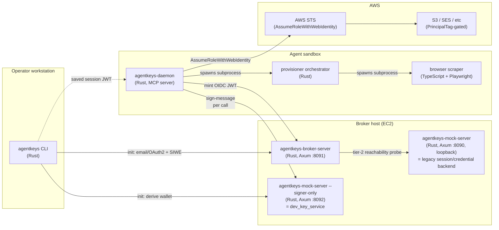
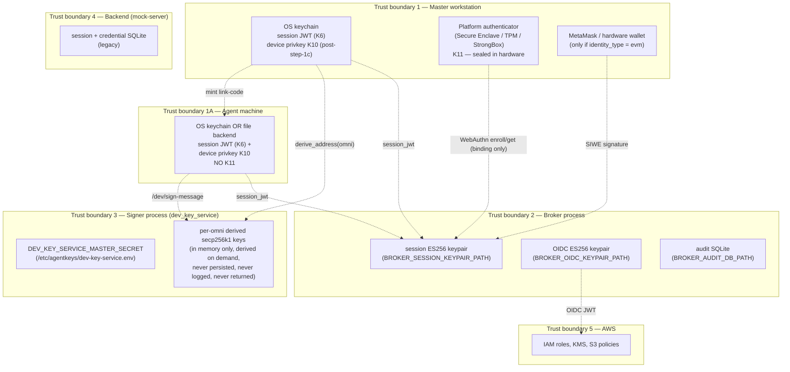
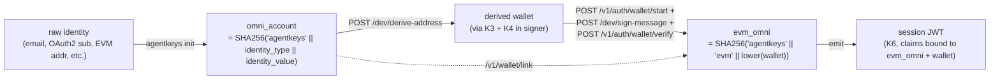
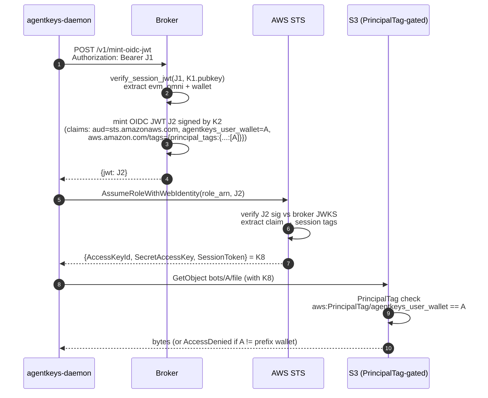
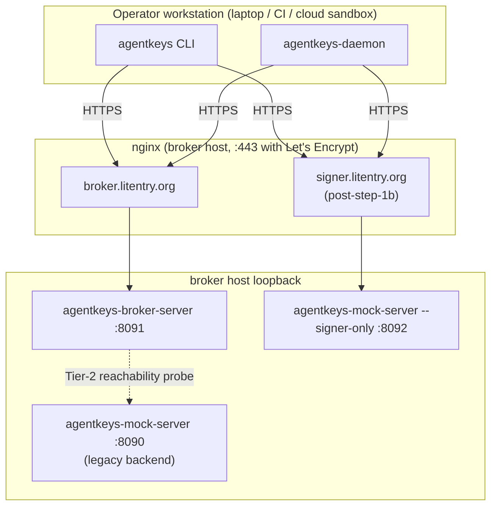

# AgentKeys — Architecture (broker, signer, daemon, key flows)

**Audience:** anyone who needs to reason about AgentKeys end-to-end —
new contributors, security reviewers, ops, design partners. Use this
as the single visual + textual reference. Diagrams are Mermaid where
possible so they render in GitHub and copy cleanly into Figma.

**Status:** canonical (post-issue-#74). Supersedes `docs/stage7-wip.md`
(archived). Component inventory and language choices were absorbed
from the prior `architecture.md` revision.

**Companion docs (canonical for their narrow surface; this doc links
to them rather than duplicating):**

- [`signer-protocol.md`](signer-protocol.md) — `/dev/*` wire contract
- [`threat-model-key-custody.md`](threat-model-key-custody.md) —
  retroactive-confidentiality + key custody position
- [`heima-gaps-vs-desired-architecture.md`](heima-gaps-vs-desired-architecture.md)
  — what current-Heima is missing vs the desired AgentKeys
  architecture
- [`credential-backend-interface.md`](credential-backend-interface.md)
  — 15-method `CredentialBackend` trait
- [`plans/issue-74-dev-key-service-plan.md`](plans/issue-74-dev-key-service-plan.md)
  — dev_key_service signer (issue #74 step 1)
- [`plans/issue-74-step-1c-device-key-auth.md`](plans/issue-74-step-1c-device-key-auth.md)
  — device-key auth on `/dev/*` (issue #74 step 1c, planned)

---

## 1. Component map



**Three independent trust boundaries, three independent products:**

| Service | Public hostname (typical) | Holds | Role |
|---|---|---|---|
| Broker | `broker.litentry.org` | ES256 OIDC keypair, ES256 session keypair, audit DB | Mints session JWTs after identity ceremony; mints OIDC JWTs from session JWTs; never holds AWS principals at runtime |
| Signer (`dev_key_service`) | `signer.litentry.org` (post-step-1b) | `DEV_KEY_SERVICE_MASTER_SECRET` (32 bytes hex) | Derives EVM wallets from `omni_account` and signs EIP-191 messages on the operator's behalf. Replaceable with a TEE worker post-step-2. |
| Backend (mock-server) | `127.0.0.1:8090` (loopback only) | Legacy session/credential SQLite | Tier-2 reachability target for the broker; legacy `/session/*` + `/credential/*` endpoints used by the daemon's pair-flow |

**Why three?** Compromise of any one process must NOT enable
impersonating the others. Broker compromise can't extract the master
secret (it's on the signer). Signer compromise can't mint session
JWTs (the keypair is on the broker). Backend compromise can't sign
EVM messages and can't mint cloud creds. The split is enforced by
process boundary and (at production deployment) by separate listener
+ host firewall.

---

## 2. Trust boundaries (where keys live, who can see them)



**Compromise-blast-radius table:**

| Boundary breached | What attacker gains | What they CANNOT do |
|---|---|---|
| **Master workstation** (host root, but no hardware presence) | Stolen session JWT (replay until exp); stolen K10 device key (sign on operator's behalf until rotation) | **Cannot complete WebAuthn ceremony** to bind a new device or rotate K10 — K11 sealed in Secure Enclave/TPM requires biometric/PIN. Cannot derive wallets for other operators; cannot mint session JWTs for new identities. |
| **Master workstation** (full compromise WITH hardware presence — e.g. attacker physically at machine and unlocks biometric) | Above, plus: rebind K10 to attacker-controlled pubkey, rotate device key, mint link codes for new agents | Same as above — bounded to this operator's omni; cannot reach other operators' material |
| **Agent machine** (sandbox VM, host root) | Stolen K10; stolen session JWT (replay until session-JWT TTL expires) | Cannot rebind without master-issued link code; master link-code issuance is gated by master J1 (which is gated by master K11). Cannot escalate to master compromise. |
| Broker process | Mint session JWTs for any omni; mint OIDC JWTs (gated by JWT auth, defeated by full broker compromise) | Cannot derive wallets; cannot sign EIP-191 messages; cannot AssumeRole (no AWS principal at broker). **Post-step-1c: cannot forge device signatures** because per-request K10 signature is verified at signer — broker compromise alone cannot make the signer accept an attacker request. |
| Signer process (current step-1) | Derive any wallet from any omni; sign any EIP-191 message for any omni | Cannot mint session JWTs; cannot mint OIDC JWTs; cannot reach AWS |
| Signer process (post-step-1c) | Above, AND can verify (but not forge) device-signed requests | Same as above; per-request device signatures still gate the call surface |
| Backend (mock-server) | Stale legacy session bearer; credential ciphertext (today's mock storage) | Cannot affect Stage 7 mint paths (broker verifies session JWTs locally post-issue-#71) |
| AWS account | Game over for that operator's data scope | None of the above; AWS compromise is its own incident class |

**Note on signer-process compromise.** Today's `dev_key_service` is
the **dev-stage** placeholder. Compromising the signer host = full
master-secret leak = every wallet for every operator is forge-able
forever. The TEE worker (issue #74 step 2) closes this: master secret
is sealed inside the enclave; host root no longer suffices.
Step-1c device-key auth additionally bounds the impact of broker
compromise on the signer call surface.

---

## 3. Key inventory

The complete list of cryptographic material in the system. Use this
as the source-of-truth when designing the Figma trust-flow diagram.

| # | Key | Type | Lives in | Role | Lifecycle |
|---|---|---|---|---|---|
| K1 | Broker session keypair | ES256 (P-256) | Broker process; pinned file at `BROKER_SESSION_KEYPAIR_PATH` (mode 0600); pubkey exported to `*.pub.pem` (mode 0644) for signer | Signs session JWTs (issued post-identity-ceremony, bound to omni + wallet) | Generated at first broker boot; preserved across re-deploys; manual rotation procedure TBD |
| K2 | Broker OIDC keypair | ES256 (P-256) | Broker process; pinned file at `BROKER_OIDC_KEYPAIR_PATH` (mode 0600); pubkey published at `<broker>/.well-known/jwks.json` | Signs OIDC JWTs minted by `/v1/mint-oidc-jwt` (consumed by AWS STS / GCP WIF / Tencent CAM via `AssumeRoleWithWebIdentity`) | Generated at first broker boot; rotation requires re-registering the OIDC provider in cloud IAM |
| K3 | Dev-signer master secret | 32 raw bytes (hex-encoded) | `/etc/agentkeys/dev-key-service.env` (mode 0600, owner agentkeys); auto-generated by `setup-broker-host.sh` | HKDF input for deriving per-omni secp256k1 wallets | Generated once on first broker-host setup; **never rotate** (rotation invalidates every previously-derived wallet); replaced by sealed enclave secret post-step-2 |
| K4 | Per-omni derived wallet | secp256k1 | Signer process (in memory only, derived on demand from K3 + omni; never persisted, never logged, never returned over wire) | The "managed EVM wallet" for an operator who authenticated via email/OAuth2/passkey — used by signer to sign EIP-191 messages on operator's behalf | Deterministic; same `(K3, omni)` always → same wallet; lifecycle == lifecycle of K3 |
| K5 | EVM-wallet (operator-held) | secp256k1 | Operator's MetaMask / hardware wallet / `cast wallet` | Identity authenticator for `identity_type = evm`; signs SIWE messages directly (this path bypasses K3/K4 entirely) | Operator-managed; outside AgentKeys' lifecycle |
| K6 | Session JWT | JWT (ES256 by K1) | Operator's OS keychain (via `agentkeys-core::session_store`) on the workstation; in daemon memory at runtime | Bearer credential for `/v1/mint-oidc-jwt`, `/v1/wallet/*`, post-step-1b also for `/dev/*` | TTL = `BROKER_SESSION_JWT_TTL_SECONDS` (default 18000s = 5h); re-mint requires re-running the identity ceremony |
| K7 | OIDC JWT | JWT (ES256 by K2) | Daemon memory only (transient — fetched per mint) | Web-identity token for `AssumeRoleWithWebIdentity` against AWS STS | TTL = `BROKER_OIDC_JWT_TTL_SECONDS` (bounded `[60, 3600]`, default 300s) |
| K8 | AWS temp credentials | STS access key + secret + session token | Daemon memory only (transient — refetched per provision/mint) | Direct AWS API access scoped by PrincipalTag = wallet | 1-hour TTL (STS default); short by design |
| K9 | DKIM keypair (per outbound domain) | Ed25519 | Stage 6 design — currently TEE-only, not yet implemented | **DKIM = DomainKeys Identified Mail (RFC 6376).** A per-domain signing key used to sign outbound email headers; the matching public key is published as a DNS TXT record at `<selector>._domainkey.<domain>`. Receiving mail servers fetch the pubkey via DNS, verify the signature, and use the result to decide whether the message originated from a server authorized for that domain — input to spam filtering, deliverability, and brand-impersonation defense. AgentKeys needs K9 because Stage 6 sends mail FROM operator-controlled sub-domains (e.g. for OpenRouter signups via plus-aliased addresses) and we hold the signing key ourselves rather than delegating to SES (so AWS never sees the plaintext content) — see [`heima-gaps §4`](heima-gaps-vs-desired-architecture.md). | TBD per Stage 6 spec ([`heima-gaps §4`](heima-gaps-vs-desired-architecture.md)) |
| K10 | Device key (planned, step-1c) | secp256k1 | **Master**: OS keychain (TouchID-backed on macOS, etc.) on the operator's workstation. **Agent**: OS keychain when available, else file backend at `~/.agentkeys/daemon-<wallet>/session.json` (mode 0600) — see §5a.4. Pubkey registered at the broker as a session JWT claim. | Per-request signature on `/dev/sign-message` calls — eliminates broker-as-SPOF for signer auth | Generated at init (master: WebAuthn-bound per §5a.1.M; agent: link-code-bound per §5a.1.A); bound to a session JWT; rotated by `agentkeys device rotate` per §5a.3 or by re-init; TTL = session JWT TTL |
| K11 | WebAuthn platform-authenticator credential (planned v0.2, master only) | Per-RP credential (typically EC P-256 on macOS Secure Enclave / Windows TPM / Android StrongBox) | **Master only.** Sealed inside the platform authenticator's hardware boundary (Secure Enclave / TPM / StrongBox); cannot be exfiltrated even by host-OS root. Credential ID published at the broker as a session JWT claim (`agentkeys_webauthn_cred`). | Hardware-attested **user-presence proof at the binding ceremony** (init per §5a.1.M, device-switch per §5a.2.M, intentional rotation per §5a.3.M). NOT used per-request — K10 covers per-request signing without biometric. | Created at master init; survives K10 rotations; revoked by removing the credential from the broker's bound list or by destroying the platform authenticator (factory reset, hardware destruction) |

**Notation throughout the rest of this doc:** the K1–K11 indices
above are referenced directly so any flow can be unambiguously
mapped back to which key signed/verified/wrapped what.

---

## 4. Identity model



**Two omnis per operator, both correct, both load-bearing:**

- **Identity omni** (`OMNI`) — derived from the user's authenticator
  (email, OAuth2 sub, etc.). The signer uses this to derive the
  managed wallet. The operator's CLI/daemon uses this to call
  `/dev/sign-message`.
- **EVM omni** (`EVM_OMNI`) — derived from the **derived wallet
  address**. The session JWT is bound to this; the broker stamps
  audit rows under it; the OIDC JWT carries it as
  `agentkeys_user_wallet`.

The identity omni and the EVM omni are linked at the broker via
`POST /v1/wallet/link` so any linked identity can recover the same
EVM omni.

For an operator who authenticates with `identity_type = evm` (their
own wallet via SIWE, no dev_key_service involvement), the two omnis
are independent: identity omni = `("evm", their_real_wallet)`, EVM
omni = `("evm", their_real_wallet)`. They are equal in this case
because the user's identity IS their wallet.

---

## 5. Cold-start (init) sequence

The init flow has two halves: an **identity ceremony** (proves the
operator owns an authenticator: email, OAuth2 sub, EVM wallet, etc.)
and a **wallet binding** (signer derives the EVM wallet from the
identity-omni; broker links the wallet to the omni; SIWE round-trip
mints the long-lived EVM-omni session JWT). Step 1c (planned) puts
device-key generation **before** the identity ceremony so the
ceremony can bind the device pubkey atomically — same trust shape
as a WebAuthn credential creation ceremony.

> **Status:** the sequence below shows the **v1c-interim email
> flow** with bespoke `pop_sig` field. For the v0.2 target
> (uniform WebAuthn binding for masters, link-code binding for
> agents), see [§5a.1](#5a1-first-time-init-binding) — that is
> the canonical reference. §5 here is preserved for the
> implementation actually shipping in step-1c.

```mermaid
sequenceDiagram
  autonumber
  participant Op as Operator
  participant CLI as agentkeys CLI
  participant KC as OS Keychain
  participant Brk as Broker
  participant Sig as Signer (dev_key_service)

  Note over CLI,KC: Step 0 — generate device keypair LOCALLY (post-step-1c)
  Op->>CLI: agentkeys init --email alice@x.com --broker-url B --signer-url S
  CLI->>CLI: generate device keypair (D_priv, D_pub); persist D_priv in KC
  CLI->>CLI: sign request payload {email, D_pub} with D_priv (proof of possession — Q7)

  Note over CLI,Brk: Step 1 — identity ceremony (binds D_pub atomically)
  CLI->>Brk: POST /v1/auth/email/request {email, device_pubkey: D_pub, pop_sig}
  Brk->>Brk: verify pop_sig against D_pub (proves CLI holds D_priv)
  Brk->>Brk: store (request_id, email, D_pub, expiry)
  Brk-->>CLI: {request_id, status: "sent"}
  Note over Brk,Op: Magic link emailed: https://broker/.../landing/<id>?device=D_pub
  Op-->>Brk: GET /v1/auth/email/landing/<id>?device=D_pub
  Brk->>Brk: confirm ?device matches stored D_pub (defends link-forwarding swap)
  loop poll
    CLI->>Brk: GET /v1/auth/email/status/<id>
    Brk-->>CLI: {status: "verified", session_jwt: J0, omni_account: O_id}
  end
  Note right of Brk: J0 carries claim agentkeys_device_pubkey = D_pub

  Note over CLI,Sig: Step 2 — wallet binding (signer is a pure RPC dependency)
  CLI->>Sig: POST /dev/derive-address {O_id}<br/>Authorization: Bearer J0
  Sig->>Sig: verify J0 against broker pubkey; HKDF(K3, O_id) → K4_priv → addr A
  Sig-->>CLI: {address: A, key_version: 1}
  CLI->>Brk: POST /v1/wallet/link {evm, A}<br/>Authorization: Bearer J0
  Brk-->>CLI: 200 (links O_id ↔ A)

  Note over CLI,Brk: Step 3 — SIWE round-trip mints the EVM-omni session JWT
  CLI->>Brk: POST /v1/auth/wallet/start {address: A}
  Brk-->>CLI: {request_id, siwe_message: M}
  CLI->>Sig: POST /dev/sign-message {O_id, message_hex: hex(M)}<br/>Authorization: Bearer J0
  Sig->>Sig: derive K4_priv from O_id; sign EIP-191(M) → sig
  Sig-->>CLI: {signature: sig, address: A}
  CLI->>Brk: POST /v1/auth/wallet/verify {request_id, signature: sig}
  Brk->>Brk: ecrecover → A; mint EVM-omni session JWT J1<br/>(claims: evm_omni, wallet=A, agentkeys_device_pubkey=D_pub)
  Brk-->>CLI: {session_jwt: J1, omni_account: O_evm, wallet_address: A}
  CLI->>KC: persist J1 (D_priv was already persisted at step 0)
```

**Key takeaways:**

- **Device key is generated FIRST** (step 0), before any network
  traffic. The identity ceremony binds D_pub atomically, so by the
  time the broker mints session JWTs, the device-pubkey claim is
  already authoritative. This ordering is what makes step 1c's
  per-request signature scheme work without a separate
  registration step.
- **Proof of possession** at request time (`pop_sig` over the
  request payload, signed by D_priv) closes Q7's "what if attacker
  substitutes their own pubkey?" concern — the broker rejects any
  request whose pop_sig doesn't verify against the claimed D_pub.
- The signer is called **twice**: once to derive the address,
  once to sign the SIWE challenge. Both calls carry the same J0
  bearer; both verify J0 + D_pub binding.
- The operator's `J0` (identity-omni session — email/oauth2/etc.)
  is **transient** — used only for `/v1/wallet/link` and the
  `/dev/*` calls during init. The `J1` (evm-omni session) is the
  long-lived bearer the daemon uses going forward.
- D_pub is bound in BOTH J0 and J1, so the same device key
  authorizes per-request signatures across the entire session
  lifecycle.

For per-identity-type variations (OAuth2 vs email vs evm vs
sandbox-link-code) and the device-rotation flows, see §5a below.

---

## 5a. Per-identity-type init + device-rotation processes

This section is the canonical reference for **how the device-key
binding works** across identity types and machine classes. The
step-1c plan defers to this section; if the two ever diverge, this
doc is authoritative.

### Two machine classes, two binding ceremonies

The init flow has two halves: an **identity ceremony** (proves the
operator owns the authenticator: email / OAuth2 sub / EVM wallet)
and a **device-key binding ceremony** (proves the machine
requesting the binding holds the device private key D_priv). Identity
ceremonies are identity-source-specific and cannot be normalized
— they are what proves the human. The binding ceremony branches
on machine class:

| Machine class | Binding ceremony | Why |
|---|---|---|
| **Master machine** — laptop / desktop with platform authenticator (Touch ID / Windows Hello / Android biometric) | **WebAuthn enrollment** (K11). Hardware-attested, phishing-resistant, identity-type-agnostic. | One ceremony shape regardless of identity type; D_pub is committed atomically inside the WebAuthn challenge so no separate `pop_sig` field is needed. |
| **Agent machine** — VM / Linux box without platform authenticator / CI runner / `agent-infra/sandbox` container | **Link-code** redeemed against the master's authenticated session. | Agent has no human present and no hardware authenticator to attest to. Master's WebAuthn-attested J1 vouches; agent only proves possession of D_priv via PoP over the link code. |

**YubiKey-on-Linux as a master tier** (roaming authenticator binding ceremony, lets a Linux box act as a master without a built-in platform authenticator) is deferred — see [issue #79](https://github.com/litentry/agentKeys/issues/79).

### Status of the WebAuthn-uniform binding (v1c → v0.2)

The four bespoke per-identity PoP shapes documented in earlier
revisions (`pop_sig` field for `email_request` and `oauth2_start`,
dual-sign-SIWE for `evm`, separate WebAuthn for `passkey`) are
**superseded** by the uniform WebAuthn enrollment described in
§5a.1 below. v1c may ship the bespoke shapes as an interim; v0.2
collapses them into the WebAuthn-uniform ceremony. The
identity-source ceremonies (email click, OAuth callback, EVM SIWE
to prove identity) remain per-type because they are inherent to
the identity source.

### 5a.1 First-time init binding

The flow is a three-stage pipeline:

0. **Device-key generation (stage 0, local-only)** — at daemon startup the CLI generates `(D_priv, D_pub) = K10` if not already persisted. D_priv goes to OS keychain (master) or file backend (agent — see §5a.4). **No network traffic.** D_pub is now available for both subsequent stages and survives daemon restarts unchanged. This matches the §5 sequenceDiagram's "Step 0 — generate device keypair LOCALLY".
1. **Identity ceremony (stage 1)** — verify the operator's authenticator. One of `email-link`, `oauth2_google`, `evm`, `passkey-as-identity` (see below). Returns `(verified_identity, request_id, binding_nonce, expiry)` to the broker; broker does NOT mint a session JWT yet.
2. **Binding ceremony (stage 2)** — bind the already-generated D_pub atomically with the JWT mint. Branches on machine class (master → WebAuthn; agent → link-code). See `5a.1.M` and `5a.1.A` below.

All three stages must succeed before the broker mints J0. D_pub is a claim in J0; subsequent `/dev/*` calls verify per-request signatures against that claim per [step-1c plan](plans/issue-74-step-1c-device-key-auth.md).

Stage 0 happens **before** stage 1 in every flow (master, agent, v1c, v0.2). This is non-negotiable: D_pub must exist before the identity ceremony can include it (v1c `pop_sig` needs D_priv to sign; v0.2 WebAuthn challenge folds D_pub into `SHA256(binding_nonce || D_pub)`). Both versions land in the same place — D is generated first, then the ceremony binds it.

#### Identity ceremonies (verify the human)

Identity verification is identity-source-specific — these prove "the human owns the authenticator," nothing more. Each ceremony hands the broker a `binding_nonce` to feed into the binding ceremony.

| Identity type | Ceremony shape | Output |
|---|---|---|
| `email-link` | Broker emails magic link to claimed address; operator clicks; broker confirms link consumption single-use within TTL | `(email, binding_nonce)` |
| `oauth2_google` | Broker redirects browser to Google; OAuth2 callback returns `code`; broker exchanges `code` for ID token; verifies issuer, audience, signature | `(google_sub, binding_nonce)` |
| `evm` | Broker generates SIWE-shaped identity-only payload (NO `Device Pubkey` field — that lives in the binding ceremony); operator signs with EVM key (MetaMask / hardware wallet); broker verifies via EIP-191 ecrecover | `(evm_address, binding_nonce)` |
| `passkey-as-identity` | WebAuthn assertion against an existing platform-authenticator credential the broker already knows about (i.e., this is for re-auth, not first-time enrollment) | `(webauthn_user_handle, binding_nonce)` |

The `binding_nonce` is a 32-byte CSPRNG value the broker stores alongside the verified-identity row. It is consumed by exactly one binding ceremony within the row's TTL (default 5 minutes); reuse rejected.

#### 5a.1.M Master binding ceremony — WebAuthn (uniform, v0.2 target)

```
ON MASTER:
   PRECONDITION (from stage 0): D_priv/D_pub = K10 already exists in OS keychain.
   PRECONDITION (from stage 1): identity ceremony returned binding_nonce.

1. CLI: open browser to https://broker/v1/auth/bind/<request_id>
2. Browser: navigator.credentials.create({
     challenge: SHA256(binding_nonce || D_pub),     # D_pub from stage 0
     rp.id:     broker.litentry.org,
     authenticatorSelection: { authenticatorAttachment: "platform",
                                 userVerification: "required" },
     attestation: "direct"
   })
   → user does Touch ID / Hello / biometric
   → returns hardware-attested signature + WebAuthn credential
3. Browser → broker: POST /v1/auth/bind/<request_id>
                       { webauthn_attestation, device_pubkey: D_pub }
4. Broker: verify WebAuthn attestation chain;
            verify challenge equals SHA256(binding_nonce || D_pub);
            bind (omni, device_pubkey: D_pub,
                   webauthn_credential_id: K11_id, exp);
            mint session JWT with claims:
              agentkeys_device_pubkey = D_pub      (K10 — used per-request)
              agentkeys_webauthn_cred = K11_id     (used at re-bind / rotate)
5. CLI: poll status → receive J0 with both claims.
6. CLI: persist J0 in OS keychain (D_priv was already persisted at stage 0).
```

The WebAuthn signature serves double duty: hardware-attested **user presence** + atomic **commitment to D_pub** (because D_pub is folded into the WebAuthn challenge). No separate `pop_sig` field needed — the WebAuthn signature IS the PoP.

Key property: **email-account compromise alone cannot rebind**. An attacker who phished the email account can complete the email-link identity ceremony but cannot complete the WebAuthn ceremony on the legitimate user's hardware (TouchID/Hello requires the physical device). This is the Q7 fix.

#### From J0 to J1 (master only — bridge to per-mint flows)

J0 minted above is the **identity-omni** session JWT (claims bound to the identity authenticator: email-omni / oauth2-omni / evm-omni-of-identity-source / etc.). It is short-lived and used only to drive the wallet-binding round-trip. To get the long-lived **EVM-omni** session JWT (`J1`) the master uses for per-mint flows and link-code minting in §5a.1.A, the master runs §5 steps 2-3 immediately after the binding ceremony:

```
7. CLI → signer: POST /dev/derive-address {O_id}
                  Authorization: Bearer J0
   → returns wallet address A = HKDF(K3, O_id) → secp256k1 → addr.

8. CLI → broker: POST /v1/wallet/link {evm, A}
                  Authorization: Bearer J0
   → broker links O_id ↔ A.

9. CLI → broker: POST /v1/auth/wallet/start {address: A}
   → broker returns SIWE message M.

10. CLI → signer: POST /dev/sign-message {O_id, message_hex: hex(M)}
                   Authorization: Bearer J0
    → signer signs EIP-191(M) with K4_priv (HKDF-derived).

11. CLI → broker: POST /v1/auth/wallet/verify {request_id, signature}
    → broker ecrecover → A; mints J1 = EVM-omni session JWT.
       Claims: evm_omni, wallet=A, agentkeys_device_pubkey=D_pub,
                agentkeys_webauthn_cred=K11_id.

12. CLI: persist J1 in OS keychain (J0 may be discarded).
```

Both `agentkeys_device_pubkey` (K10) and `agentkeys_webauthn_cred` (K11) claims propagate from J0 into J1 atomically — the master's binding ceremony output is preserved across the J0 → J1 transition. **J1 is the bearer referenced as `J1_master` in §5a.1.A's precondition** and is the same long-lived session JWT used for `/v1/mint-oidc-jwt`, `/v1/wallet/link`, and post-step-1b `/dev/*` calls per §6.

For the `evm` identity-type variant, steps 7-11 collapse: the user's own EVM key IS the wallet, so there's no signer call at init and no separate wallet-link step — the broker mints J1 directly at the end of §5a.1.M (same evm-omni it would have arrived at via the round-trip).

#### 5a.1.A Agent binding ceremony — link-code (uniform)

The agent machine has no human present and no platform authenticator. The master vouches by issuing a one-time link code from its already-authenticated session.

```
ON MASTER (already initialized per §5a.1.M + the J0 → J1 bridge above; holds J1_master = the long-lived EVM-omni session JWT with K10 + K11 claims):
1. CLI: agentkeys link-code mint --omni O_evm
2. CLI → broker: POST /v1/auth/link-code/mint
                  { omni_account: O_evm, ttl_seconds: 600 }
                  Authorization: Bearer J1_master
3. Broker: verify J1_master (binds back to master's K11 via the
            agentkeys_webauthn_cred claim);
            mint one-time link code "AGK-A8F3-92K1" bound to O_evm.
4. CLI: print the link code for the operator (or auto-pipe to agent
         provisioning).

ON AGENT MACHINE:
5. agentkeys-daemon --init-link-code AGK-A8F3-92K1 \
                    --broker-url B --signer-url S
6. Stage 0 (daemon startup, per §5a.1): generate (D_priv, D_pub) = K10;
   persist D_priv per §5a.4 (OS keychain when available, else file backend
   ~/.agentkeys/daemon-<wallet>/session.json mode 0600).
   No identity ceremony precedes — the link code is the bootstrap.
7. Daemon → broker: POST /v1/auth/link-code/redeem
                     { link_code: "AGK-A8F3-92K1",
                       device_pubkey: D_pub,
                       pop_sig: sign(D_priv, link_code || D_pub) }
8. Broker: verify pop_sig (proves daemon holds D_priv for D_pub);
            mark link code consumed (single-use);
            bind (omni, device_pubkey: D_pub, exp) with attribution
              "via link_code minted from master J1_master";
            mint J1_vm with claim agentkeys_device_pubkey = D_pub.
9. Daemon: persist J1_vm; enter MCP-stdio loop.
```

Trust chain: `master human → master platform authenticator (K11) → master J1 → link code → agent J1_vm`. The agent never holds a user-presence credential; the master's WebAuthn-attested authority chains through the link code.

The link code is a bearer credential bounded by (single-use, 600s TTL, scoped to one omni). Per `agent-infra/sandbox`'s pattern (see [`docs/spec/1-step-analysis.md`](1-step-analysis.md)), this is the right shape because the agent is a credential CONSUMER, not a credential HOLDER — short-TTL bearer in, short-TTL JWT out.

#### v1c interim — bespoke per-identity PoP shapes

For v1c (pre-WebAuthn-binding), the master flow uses bespoke per-identity PoP shapes inline with each identity ceremony rather than the uniform WebAuthn ceremony in 5a.1.M:

- `email` — `pop_sig` field over `canonical(email || D_pub || nonce)` in `POST /v1/auth/email/request`
- `oauth2_google` — `pop_sig` field over `canonical("oauth2_google" || D_pub || state_nonce)` in `POST /v1/auth/oauth2/start`; `state = SHA256(D_pub || state_nonce)` carries D_pub through Google's redirect
- `evm` — SIWE-shaped binding payload includes `Device Pubkey: D_pub`; one MetaMask / hardware-wallet popup at init signs both identity AND device-pubkey commit

Wire shapes pinned in [step-1c plan §"Per-identity-type init binding"](plans/issue-74-step-1c-device-key-auth.md). The agent (link-code) ceremony in 5a.1.A is unchanged between v1c and v0.2.

### 5a.2 Switch to a new device

#### 5a.2.M New master (e.g. operator gets a new laptop)

The new master re-runs an identity ceremony AND a fresh WebAuthn
enrollment on the new device. The broker binds D_pub' atomically
with the new K11' credential. The old D_pub is either retained
(multi-device, v0.2) or replaced (single-device, default).

```
ON NEW MASTER:
0. Stage 0 (daemon startup, per §5a.1): generate fresh
   (D_priv', D_pub') = K10'; persist D_priv' in OS keychain.
1. CLI: agentkeys init --email alice@x.com (or any identity type)
2. Run identity ceremony per §5a.1 — broker returns binding_nonce.
3. Run master binding ceremony per §5a.1.M — WebAuthn ceremony
   enrolls a NEW platform-authenticator credential = K11' on the
   new device's hardware (Touch ID / Hello / StrongBox); the
   WebAuthn challenge folds in D_pub' from stage 0.
4. Broker observes pre-existing binding (D_pub_old, K11_old)
   for the same omni and either:
     (a) ADDS (D_pub', K11') alongside (multi-device, v0.2), OR
     (b) REPLACES old binding (single-device default, v1c).
5. Broker mints J1' bound to (omni, D_pub', K11').
6. New master persists J1' (D_priv' was persisted at stage 0).

OLD MASTER (if (b) was chosen):
7. Next /dev/sign-message call: signer rejects D_pub_old's
   signature (no longer matches binding) → CLI prints
   "device key superseded — re-init required".
```

**Security note (Q7).** First-time enrollment on the new master
relies on the identity ceremony alone — an attacker who phished
the email account and has their own platform authenticator can
complete this flow. To defeat that, the v0.2 target adds a
**cross-device confirmation** step: when the broker observes a
pre-existing K11_old binding, it requires a WebAuthn `get()`
against K11_old (push-notification to the existing master) before
binding K11'. With cross-device confirmation, email-only attackers
fail because they don't possess the legitimate user's existing
hardware authenticator. v1c ships without cross-device
confirmation; v0.2 adds it.

#### 5a.2.A New agent (e.g. fresh sandbox VM)

The agent's old binding becomes orphaned; the master mints a
fresh link code and the new agent runs §5a.1.A.

```
ON MASTER:
1. CLI: agentkeys link-code mint --omni O_evm
2. Broker: mints fresh link code (consumes nothing — old agent's
   D_pub_vm_old binding is unaffected; an explicit revocation is
   a separate operator step).

ON NEW AGENT:
3. agentkeys-daemon --init-link-code <new-code>
   → runs §5a.1.A to bind D_pub_vm_new under the same omni.
4. Broker: ADDS the new binding alongside the old (agents are
   multi-device by default — many concurrent VMs are typical).

ON OPERATOR (optional):
5. CLI: agentkeys device revoke --pubkey D_pub_vm_old
   → broker removes the orphaned agent binding (defensive
   cleanup; not required for security).
```

For the v0.2 multi-device master case, each master's J1 carries
its own D_pub + K11 claims; signatures from any bound master are
valid until that specific binding is revoked.

### 5a.3 Intentional device-key swap (rotation without identity re-auth)

The operator wants to rotate D_priv without re-doing the
identity ceremony. Useful when the device key is suspected of
compromise but the operator's identity hasn't been compromised.

#### 5a.3.M Master rotation

```
ON MASTER (still has valid J1 + D_priv_old + K11):
1. CLI: agentkeys device rotate
2. CLI: generate (D_priv_new, D_pub_new); persist D_priv_new.
3. CLI: open browser → navigator.credentials.get({
     challenge: SHA256(D_pub_old || D_pub_new || rotation_nonce),
     rp.id: broker.litentry.org,
     allowCredentials: [{ type: "public-key", id: K11_id }],
     userVerification: "required"
   })
   → user does Touch ID / Hello → hardware-attested signature
4. Browser → broker: POST /v1/wallet/device/rotate
                       { old_device_pubkey: D_pub_old,
                         new_device_pubkey: D_pub_new,
                         webauthn_assertion,
                         sig_new: sign(D_priv_new, rotation_nonce) }
                     Authorization: Bearer J1
5. Broker: verify J1; verify WebAuthn assertion against K11
            (proves user-presence at the master device);
            verify sig_new against D_pub_new
            (proves CLI holds new device key);
            replace binding (omni, D_pub_old) → (omni, D_pub_new);
            mint J1_new with claim D_pub_new (K11 unchanged);
            revoke J1.
6. CLI: persist J1_new; clear D_priv_old.
```

Rotation requires **a valid J1 + Touch ID/Hello + holding D_priv_new**.
If the operator has lost D_priv_old (laptop stolen, keychain wiped)
but still has K11 (the platform authenticator survived), the
WebAuthn assertion alone is sufficient — the broker drops the
`sig_old` requirement when K11 attests to user-presence. If both
D_priv_old AND K11 are lost (laptop physically destroyed), fall
back to §5a.2.M — re-do the identity ceremony from a new device.

**v1c interim**: rotation uses dual-D_priv-signature
(`sig_old + sig_new`) without WebAuthn. Same flow shape; K11
attestation replaces `sig_old` in v0.2.

#### 5a.3.A Agent rotation

Agents do not rotate independently — the master mints a fresh
link code and the new agent runs §5a.1.A. The old agent's
binding can optionally be revoked via `agentkeys device revoke`
from the master per §5a.2.A.

### 5a.4 Agent machine device-key persistence

This section answers two questions for agent machines (VM / Linux
without platform authenticator / CI runner / `agent-infra/sandbox`
container) that bound their device key via §5a.1.A.

#### 1. Where does D_priv live on an agent machine?

OS keychain when available (Linux GNOME Keyring, Windows
Credential Locker). When no keychain is available — `agent-infra/
sandbox`'s default Docker container exposes none —
[`keyring-rs`](https://crates.io/crates/keyring) falls back to a
file backend at `~/.agentkeys/daemon-<wallet>/session.json` (mode
0600, owner-only).

Reference: [`docs/spec/1-step-analysis.md`](1-step-analysis.md)
analyzed `agent-infra/sandbox`'s identity model and confirmed
the file backend is both available and idiomatic; the sandbox
itself is explicitly designed as a credential PASS-THROUGH
(short-TTL JWTs in, short-TTL JWTs out), not a credential VAULT.

#### 2. Does D_priv survive container/VM restart?

Depends on whether the file (or keychain) persists across the
restart, which depends on the agent's lifecycle:

| Agent lifecycle | D_priv behavior | Operator action |
|---|---|---|
| **Long-lived** (sandbox running for hours/days within one container instance, e.g. an `agent-infra/sandbox` session for a multi-hour LLM task) | File persists across daemon restarts within the container | None — daemon re-reads on startup |
| **Ephemeral** (container destroyed between sessions, e.g. nightly CI job) | D_priv vanishes with the container | Master mints a fresh link code per §5a.1.A; agent runs `agentkeys-daemon --init-link-code <new-code>`. **No human re-presence required** — the master's `agentkeysd` orchestrator does this autonomously |
| **Hardened** (TPM / Secure Enclave passthrough, AWS Nitro Enclave, Azure Confidential VM) | D_priv pinned to hardware authenticator OR sealed to boot measurement | Survives container destruction; v0.2 enhancement |

#### Why this is the right answer (not a workaround)

Earlier drafts framed the ephemeral case as a friction problem
requiring TEE attestation or KMS-wrapped secrets. The link-code
pattern resolves it without TEE for the common case because:

- The **master** holds the long-lived authority (K10 + K11).
  Agents are short-lived consumers.
- The master's `agentkeysd` (always-on or wake-on-demand) can
  auto-mint a link code on agent-restart signal — no human
  re-presence per restart.
- This mirrors `agent-infra/sandbox`'s **two-tier pattern**: the
  business-service orchestrator holds the long-lived signing key;
  the sandbox holds only short-TTL bearer credentials. We get the
  same architectural property: leaked sandbox env = at most one
  link-code-TTL of access, scoped to that agent's permissions.
- TEE / Nitro Enclave passthrough remains the v0.2 hardening for
  adversary-resistant sandboxes (e.g. running untrusted user
  code), not the default.

The link-code-per-session model is the **default v1c ship state**
for ephemeral agents and an explicit architectural choice, not a
limitation.

### 5a.5 Trust shape across machine classes

The two binding ceremonies (master WebAuthn vs. agent link-code)
have different security shapes. Per-request signing is identical
across both — the asymmetry lives entirely at init / re-bind
time.

| Machine class | Init cost | Per-request cost | D_priv (K10) leak blast radius | Re-bind requires |
|---|---|---|---|---|
| **Master** (platform authenticator) | One identity ceremony + one WebAuthn enrollment (Touch ID / Hello / biometric) | Zero — D_priv signs in background | Forge `/dev/*` calls until rotation; bounded to one operator's omni | Hardware presence (WebAuthn `get()` against K11). Email-account compromise alone is **insufficient** (v0.2 with cross-device confirmation). |
| **Agent** (no platform authenticator) | One link-code redeem from master | Zero | Same as master | A fresh link code from a still-authorized master. Agent compromise alone cannot rebind (master J1 + master K11 required upstream). |
| **Master with passkey-as-identity** (v0.2 — passkey IS the identity source) | One WebAuthn ceremony serves both identity AND binding | Zero | **None for K10** (sealed in hardware); forge-until-rotation if K10 file leaks | Same WebAuthn ceremony |
| **Hardened agent** (TPM / Secure Enclave / Nitro Enclave) | Link-code redeem at first boot; subsequent boots restore D_priv from hardware seal | Zero | None — D_priv cannot be exfiltrated | Re-attestation if boot measurement changes |

Per-request signature shape converges across all classes;
distinction is binding-time only. Heima's `ClientAuth` enum
([`heima-gaps §12`](heima-gaps-vs-desired-architecture.md))
classifies operations by per-call tier; AgentKeys flattens that
— every operation gets the strong tier because per-request UX
cost is zero regardless of binding-time shape.

Identity-source-specific costs (one email click, one OAuth
redirect, one MetaMask popup) live entirely inside the identity
ceremony per §5a.1 and are independent of the master/agent split.

---

## 6. Per-mint sequence (issue #71 Option A — daemon-side)



**Three things AgentKeys validates here that a static-IAM-user
deployment cannot:**

1. **Per-omni cred scoping.** S3 enforces the prefix match against
   the assumed-role session's PrincipalTag — by AWS policy engine,
   not by app code.
2. **No long-lived AWS principal at the broker.** Issue #71 Option A
   moved the broker off `sts:AssumeRole` (which required broker IAM
   creds) onto `sts:AssumeRoleWithWebIdentity` (driven by JWT). The
   broker holds zero AWS material at runtime.
3. **Daemon-side mint.** The provisioner runs the entire
   STS-call client-side, only bouncing through the broker for the
   JWT. Broker compromise affects the JWT-signing surface, not the
   STS call itself.

---

## 7. Pluggable surfaces

The architecture is intentionally pluggable on four axes. Each axis
has a default v0/v0.1 implementation and a documented swap-in path.

| Axis | v0/v0.1 default | Future swap | Swap mechanism |
|---|---|---|---|
| **Auth method** (broker-side identity verification) | `wallet_sig` (SIWE) + `email_link` + `oauth2_google` | passkey, OAuth2/Apple, OAuth2/GitHub, custom OIDC | Trait-implementing plugin in [`crates/agentkeys-broker-server/src/plugins/auth/`](../../crates/agentkeys-broker-server/src/plugins/auth/); enabled via `BROKER_AUTH_METHODS` env var |
| **Signer backend** (`/dev/*` implementation) | `dev_key_service` HKDF (issue #74 step 1) | TEE worker (sealed master secret, attested mTLS — issue #74 step 2); future threshold-MPC | Replaces the binary behind `signer.<zone>` URL; wire shape pinned by [`signer-protocol.md`](signer-protocol.md) |
| **Audit destination** (mint + auth audit log) | SQLite at `BROKER_AUDIT_DB_PATH` | Heima parachain, Ethereum L2, permissioned chain (Hyperledger / Quorum / Aliyun BaaS), TEE-attested append-only log, AWS CloudTrail | Trait surface in [`crates/agentkeys-broker-server/src/plugins/audit/`](../../crates/agentkeys-broker-server/src/plugins/audit/) |
| **Vault backend** (where credential ciphertext lives — Stage 8) | `s3://agentkeys-vault/<wallet>/...` (PrincipalTag-gated) | IPFS / Filecoin / Arweave content-addressed multi-backend; on-chain pointer + hash | Per [`threat-model-key-custody.md` §4 + §9](threat-model-key-custody.md) |

**Pluggability is the point.** No single backend is load-bearing for
the architecture; the contracts (auth-plugin trait, signer-protocol,
audit trait, vault interface) are. This is what lets:

- A China-deployment operator point audit at a permissioned chain
  without touching the rest.
- A self-hosted operator skip the chain entirely (SQLite is a
  complete v0.1 audit destination per
  [§7 audit-destination row 4](#7-pluggable-surfaces)).
- The TEE worker swap into the signer slot post-issue-#74 step 2
  with zero daemon/CLI code change.

---

## 8. Cargo workspace

```
agentkeys/                                  # repo root
├── crates/
│   ├── agentkeys-types/                    # shared types (Identity, Session, ...)
│   ├── agentkeys-core/                     # CredentialBackend trait, signer_client,
│   │                                       #   init_flow, mock_client, session_store
│   ├── agentkeys-mock-server/              # backend (loopback) + signer (--signer-only)
│   │   ├── src/dev_key_service.rs          # K3/K4: HKDF + secp256k1 + EIP-191
│   │   └── src/handlers/dev_keys.rs        # /dev/derive-address + /dev/sign-message
│   ├── agentkeys-broker-server/            # K1/K2: session + OIDC JWT minting,
│   │                                       #   wallet-sig + email-link + OAuth2 plugins
│   ├── agentkeys-cli/                      # agentkeys binary (init, store, read, run,
│   │                                       #   provision, signer derive/sign, whoami)
│   ├── agentkeys-daemon/                   # daemon binary (MCP server, signer-flow init)
│   ├── agentkeys-mcp/                      # MCP adapter library (used by daemon)
│   └── agentkeys-provisioner/              # Rust orchestrator that spawns the TS scraper
└── provisioner-scripts/                    # TypeScript + Playwright scrapers
    └── src/scrapers/openrouter.ts          # one file per service (v0)
```

**One language per process, never per process.** All trust-boundary
code is Rust. The Playwright scraper is the one TypeScript exception
— it runs as a subprocess of the provisioner orchestrator and never
sees crypto material. Cross-language interaction is at the process
boundary (stdin/stdout JSON), never in-process FFI.

| Crate | Purpose |
|---|---|
| `agentkeys-types` | Shared types — `Session`, `WalletAddress`, `Scope`, `AuthToken`, `AgentIdentity`, audit + provision events |
| `agentkeys-core` | The library: `CredentialBackend` trait, `MockHttpClient`, `SignerClient` + `HttpSignerClient`, `init_flow` (broker email/OAuth2 → derive → link → SIWE chain), `session_store` (OS keychain + file fallback) |
| `agentkeys-mock-server` | Two binaries from one source: legacy backend (loopback `:8090`, `/session/*` + `/credential/*` + `/audit/*`) AND signer (`--signer-only` mode at `:8092`, `/dev/*` only) |
| `agentkeys-broker-server` | Stage 7 broker: `/v1/auth/{wallet,email,oauth2}/*`, `/v1/mint-{oidc-jwt,aws-creds}`, `/v1/wallet/{link,links,recover/lookup}`, `/v1/grant/*`, `/.well-known/{openid-configuration,jwks.json}`, `/healthz`, `/readyz`, `/metrics` |
| `agentkeys-cli` | The `agentkeys` binary — `init`, `store`, `read`, `run`, `provision`, `link`, `recover`, `revoke`, `teardown`, `usage`, `signer derive/sign`, `whoami`, `inbox` |
| `agentkeys-daemon` | The `agentkeys-daemon` binary — first-time bootstrap (signer-flow or pair-flow); MCP server over stdio post-bootstrap |
| `agentkeys-mcp` | MCP protocol adapter — used by the daemon to expose `agentkeys.provision`, etc., to the agent process |
| `agentkeys-provisioner` | Spawns the TS scraper subprocess, encrypts obtained creds, submits to backend |

---

## 9. Component inventory

| # | Component | Where it runs | Primary job |
|---|---|---|---|
| 1 | `agentkeys` CLI | Operator's workstation | `init`, `store`, `read`, `run`, `provision`, `signer ...`, `whoami`, `link`, `recover`, `revoke`, `teardown`, `usage`, `feedback` |
| 2 | `agentkeys-daemon` | Inside agent sandbox (or desktop / Pi / cloud LLM environment) | Stores session in OS keychain + file fallback, hosts MCP + CLI sockets, spawns provisioner as MCP tool |
| 3 | MCP adapter | Same process as #2 | Speaks MCP on stdio/socket, translates to daemon internal API |
| 4 | CLI adapter | Same process as #2 | Line-protocol on Unix socket for `agentkeys read` etc. |
| 5 | Broker (`agentkeys-broker-server`) | EC2 broker host | Stage 7 — auth ceremonies, session JWT minting, OIDC JWT minting, audit log |
| 6 | Signer (`agentkeys-mock-server --signer-only`) | EC2 broker host (separate listener at `:8092`) | dev_key_service — `/dev/derive-address` + `/dev/sign-message`; replaceable by TEE worker |
| 7 | Provisioner orchestrator | Inside agent sandbox, subprocess of #2 | Spawns browser automation, encrypts credentials |
| 8 | Browser automation scripts | Inside agent sandbox, child of #7 | Playwright/CDP signup flows for OpenRouter + future services |
| 9 | Ephemeral email integration | Inside agent sandbox, child of #7 | Reads verification codes from S3-backed inbound mail |
| 10 | Backend (mock-server) | EC2 broker host (loopback `:8090`) | Legacy `/session/*` + `/credential/*` + `/audit/*` (broker's Tier-2 reachability target; will be deprecated as callers migrate to the new flow) |
| 11 | Audit log indexer | Post-MVP; own host | Reads broker audit DB, exposes for `agentkeys usage` queries |
| 12 | Web GUI | Post-MVP, user's device, Tauri | Master management UI, live audit, wallet balance |
| 13 | TEE worker | Post-issue-#74 step 2 | Replaces #6 with sealed master secret + remote attestation |
| 14 | `@agentkeys/daemon` npm package | Cloud LLM environments (ChatGPT / Claude.ai) | TS wrapper around prebuilt #2 binary |

---

## 10. Language choices

**Rust for everything in the trust boundary.** Browser automation
(#8) is the one TypeScript exception — anti-bot tooling
(`playwright-extra`, `puppeteer-extra-plugin-stealth`,
`patchright`) is mature in TS, weak/absent in Rust.

| Component | Language | Reason |
|---|---|---|
| #1, #2, #3, #4, #5, #6, #7, #10, #13 | Rust | Security-critical; cross-compiles cleanly; the ecosystem (subxt, alloy, k256, jsonwebtoken, axum) covers our needs |
| #8, #9 | TypeScript + Playwright | One exception; ecosystem reality. Subprocess of #7 only — never in the cryptographic path |
| #11 | Rust (or TS Subsquid for v0.1) | Read-only, not in trust boundary; either is fine |
| #12 | Rust (Tauri backend) + TS (frontend) | Reuses #1 directly; UI layer is TS |
| #14 | TS wrapper of Rust binary | esbuild/biome/swc pattern; postinstall picks the right prebuilt #2 binary |

Approx Rust proportion: **~80% of lines, 100% of security-critical
path.**

---

## 11. Deployment topology



**Hard rules:**

- `broker.<zone>` and `signer.<zone>` are separate nginx server
  blocks with separate certs. They route to different loopback
  ports.
- The legacy backend at `:8090` is **never** publicly exposed; only
  the broker on the same host reaches it (Tier-2 probe + a few
  legacy-flow callbacks).
- Host firewall: drop public ingress to anything except `:443`.
  Nginx is the only public listener.
- Daemons that run remotely (operator's laptop, CI, cloud sandbox)
  reach `broker.<zone>` and `signer.<zone>` over public TLS.
  Daemons co-located on the broker host (atypical) can use loopback
  directly.

The full bring-up runbook lives in
[`scripts/setup-broker-host.sh`](../../scripts/setup-broker-host.sh)
(idempotent; auto-generates K3 on first run; preserves K1/K2/K3
across re-deploys). Operator-facing commentary in
[`operator-runbook-stage7.md`](../operator-runbook-stage7.md).

---

## 12. Cross-references

- **`/dev/*` wire contract** — [`signer-protocol.md`](signer-protocol.md)
- **K3 master-secret threat model** — [`threat-model-key-custody.md`](threat-model-key-custody.md)
  (note: doc primarily covers Stage 8 vault, but the
  retroactive-confidentiality argument applies to K3 by extension)
- **Broker pluggable trait surfaces** —
  [`plans/issue-64/PLAN.md`](plans/issue-64/PLAN.md) §3.5
- **dev_key_service plan** —
  [`plans/issue-74-dev-key-service-plan.md`](plans/issue-74-dev-key-service-plan.md)
- **Device-key auth plan (post-step-1b)** —
  [`plans/issue-74-step-1c-device-key-auth.md`](plans/issue-74-step-1c-device-key-auth.md)
- **Operator runbook** —
  [`../operator-runbook-stage7.md`](../operator-runbook-stage7.md)
- **End-to-end demo** —
  [`../stage7-demo-and-verification.md`](../stage7-demo-and-verification.md)
- **Cloud-side IAM + DNS + cert** —
  [`../cloud-setup.md`](../cloud-setup.md)
- **Stage 8 vault** —
  [`../stage8-wip.md`](../stage8-wip.md)
- **Heima vs current architecture gaps** —
  [`heima-gaps-vs-desired-architecture.md`](heima-gaps-vs-desired-architecture.md)
- **Pre-Stage-7 architecture history** —
  [`../archived/operator-runbook-pre-stage7.md`](../archived/operator-runbook-pre-stage7.md)
  (archived)

---

## 13. What's NOT in this doc

- **Per-endpoint request/response shapes.** Each endpoint surface
  has its own canonical doc — the broker's openapi-style table is
  in `plans/issue-64/PLAN.md`; the signer's is `signer-protocol.md`;
  the legacy backend's is `credential-backend-interface.md`.
- **Per-step environment-variable inventory.** That's
  `operator-runbook-stage7.md`.
- **Detailed threat model for retroactive confidentiality.** That's
  `threat-model-key-custody.md`.
- **Stage-by-stage build progression history.** That's
  `plans/development-stages.md`.
- **MetaMask / Foundry tooling instructions.** Removed in
  issue #74 step 1 — operators no longer hold local EVM keys
  unless they want to (`identity_type = evm` is supported but not
  required).

---

*This is a living document. Update it when the component map, key
inventory, trust-boundary table, or deployment topology changes.
For Figma-design use: the K-numbered key inventory (§3) and the
identity-model diagram (§4) are the most directly transferable.*
