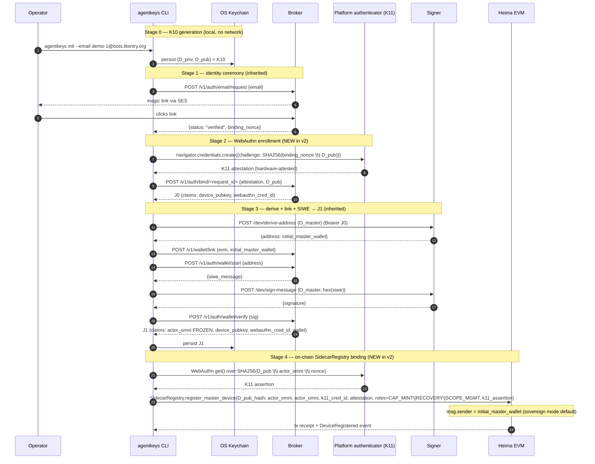

# v2 stage 1 — fresh-start demo (Litentry/Heima EVM backbone)

**Status (2026-05-24)**: this doc is transitional. The v1/v2 staging name retires after v2-stage3 ships green; M1-M7 ([`docs/plan/milestones-roadmap.md`](plan/milestones-roadmap.md)) is the forward-facing framing. Until then, this remains the operator runbook for stage-1 bring-up.

**Audience**: operators bringing up a **brand new** v2 stage-1 deployment from scratch. Everything previously inherited from the stage-7 demo is called out explicitly — that demo doc is now archived; inline pointers below go to the archive when the historical step is still relevant.

**This doc is fresh-start only.** Operators migrating from a live PR #87 / stage-7 `S3CredentialBackend` deployment are out of scope — the dual-read code path that landed in [PR #87+stage-1-step-1](crates/agentkeys-core/src/s3_backend.rs) covers that case mechanically, no operator runbook required.

**Chain backbone**: Litentry's parachain (rebranded to **Heima Network** in 2026) is the EVM L1 we deploy all stage-1 contracts on. Heima is Substrate + Frontier — `pallet_evm` + `pallet_ethereum` give native EVM compatibility with first-class EVM account addresses as `msg.sender`. Stage-1's four contracts (`AgentKeysScope`, `SidecarRegistry`, `K3EpochCounter`, `CredentialAudit`) are plain Solidity, deployed via Foundry or Hardhat using the operator's `current_master_wallet`.

**Reference docs**:
- Stage 1 deliverable inventory — [docs/plan/v2-issues/issue-v2-stage-1-foundation.md](plan/v2-issues/issue-v2-stage-1-foundation.md)
- Stage 7 demo (parent for §0 prereqs, §1 init, §2 SIWE, §3 OIDC+STS, §4 isolation proof, §5 provision) — [docs/archived/stage7-demo-and-verification-2026-04.md](archived/stage7-demo-and-verification-2026-04.md)
- Architecture v2 (single source of truth) — [docs/arch.md](arch.md)

---

## Chain backbone — pluggable per arch.md §22

AgentKeys's chain layer is **pluggable**: the four stage-1 contracts (`AgentKeysScope`, `SidecarRegistry`, `K3EpochCounter`, `CredentialAudit`) are plain Solidity, deployable to any EVM-compatible chain.

**Default conventions:**

| Environment | Default chain | CLI flag / env var |
|---|---|---|
| **Production** | `heima` (Litentry/Heima mainnet, chain ID 212013) | Built-in default; no flag needed. `export AGENTKEYS_CHAIN=heima` for explicitness. |
| **Development / testing** | `heima-paseo` (Heima Paseo testnet — `pallet_sudo` enabled with Alice as sudoer for dev convenience) | `export AGENTKEYS_CHAIN=heima-paseo` or `agentkeys --chain heima-paseo <cmd>` |
| **Local unit / integration tests** | `anvil` (local Foundry node, instant finality, zero gas) | `export AGENTKEYS_CHAIN=anvil` |
| **Cross-chain demo / multi-tenant** | per-tenant chain via `--chain <name>` | Built-in supports `heima`, `heima-paseo`, `base`, `base-sepolia`, `ethereum`, `sepolia`, `anvil`; custom chains via `AGENTKEYS_CHAIN_PROFILE_FILE`. |

You can switch to Base, Ethereum, Sepolia, a local Anvil node, or any operator-custom EVM chain with one flag.

### Selecting a chain backbone

Every chain-aware operation accepts `--chain <name>`. Resolution order (first match wins):

| Source | How |
|---|---|
| 1. `AGENTKEYS_CHAIN_PROFILE_FILE` env var | Point at a custom JSON file for chains AgentKeys doesn't ship by default |
| 2. `--chain <name>` CLI flag | One built-in profile name per command |
| 3. `AGENTKEYS_CHAIN` env var | Set once for the shell session |
| 4. Built-in default | `heima` |

Built-in profiles ship as JSON files embedded in the `agentkeys` binary at compile time (see `crates/agentkeys-core/chain-profiles/`). Each profile bundles chain ID, RPC endpoints, block explorer URL, native token symbol, finality model, and gas config — everything the CLI / daemon / broker / workers need to know about that chain.

```bash
# === ON OPERATOR WORKSTATION ===
# Enumerate built-in profiles
agentkeys chain list
# heima
# heima-paseo
# base
# base-sepolia
# ethereum
# sepolia
# anvil

# Inspect a specific profile
agentkeys chain show base
# {
#   "name": "base",
#   "display_name": "Base Mainnet (Coinbase L2)",
#   "chain_id": 8453,
#   "chain_kind": "optimism-l2",
#   "rpc": { "http": "https://mainnet.base.org", "wss": "wss://base-rpc.publicnode.com" },
#   "explorer": { "url": "https://basescan.org", ... },
#   "token": { "symbol": "ETH", "decimals": 18 },
#   "finality": { "default_block_tag": "safe", "confirmation_seconds": 600, ... },
#   ...
# }

# Switch chains for one command
agentkeys --chain ethereum chain show
# (prints the ethereum profile with --verbose tracing if -v is set)

# Switch chains for the whole session
export AGENTKEYS_CHAIN=base
agentkeys chain show
# (now resolves to base by default)
```

### Built-in profiles

| Profile | Chain ID | Chain kind | Default block tag | Gas token | Notes |
|---|---|---|---|---|---|
| `heima` | 212013 | substrate-frontier | `latest` (instant finality) | HEI | **Production default.** Heima parachain mainnet — Substrate + Frontier; HashedAddressMapping makes EVM accounts first-class on-chain identities. No sudo. |
| `heima-paseo` | auto-detect | substrate-frontier | `latest` | pHEI | **Development default.** Heima Paseo testnet. Chain ID encoded as `0` in the profile (sentinel for "call `eth_chainId` at startup"). Ships `pallet_sudo` with **Alice** as sudoer — see §"Alice + sudo on Heima Paseo" below. RPC URL pending Heima dev-team confirmation (see [heima-open-questions.md Q13](spec/heima-open-questions.md)). |
| `base` | 8453 | optimism-l2 | `safe` (5-10 min L1 batch) | ETH | Coinbase L2. Tiered finality — use `safe` for cap-mint, `finalized` for high-value payments. |
| `base-sepolia` | 84532 | optimism-l2 | `safe` | ETH | Base testnet. Faucet: coinbase.com/faucets/base-ethereum-sepolia-faucet |
| `ethereum` | 1 | ethereum-l1 | `finalized` (~12.8 min) | ETH | Highest finality assurance; default tag is `finalized` because Ethereum mainnet gas is expensive. |
| `sepolia` | 11155111 | ethereum-l1 | `finalized` | SepoliaETH | Ethereum testnet. Faucet: alchemy.com/faucets/ethereum-sepolia |
| `anvil` | 31337 | local-dev | `latest` (instant) | ETH | Local Foundry dev node. Default test key + zero gas — use for tests + demo bring-up before pointing at a live chain. |

### Alice + sudo on Heima Paseo (development-environment convenience)

Heima Paseo's runtime ships `pallet_sudo` with the **well-known Substrate dev account Alice** as the sudoer. This is standard Substrate-testnet practice — Alice's keypair is intentionally public (every Substrate developer knows the seed phrase) so that anyone running a dev workflow can immediately have a god-mode account on the testnet for unblocking common bring-up tasks.

```
Alice's well-known dev key:
  Seed phrase: bottom drive obey lake curtain smoke basket hold race lonely fit walk//Alice
  Public key:  0xd43593c715fdd31c61141abd04a99fd6822c8558854ccde39a5684e7a56da27d
  SS58 (generic prefix 42): 5GrwvaEF5zXb26Fz9rcQpDWS57CtERHpNehXCPcNoHGKutQY
  SS58 on Heima (prefix 31): (re-encode of same pubkey — confirm with Kai per Q14)
```

**The chain profile surfaces this via `dev_environment.sudo`:**

```bash
agentkeys --chain heima-paseo chain show | jq '.dev_environment'
# {
#   "is_development_default": true,
#   "sudo": {
#     "enabled": true,
#     "sudoer_alias": "alice",
#     "sudoer_seed_phrase": "bottom drive obey lake curtain smoke basket hold race lonely fit walk//Alice",
#     "sudoer_public_key": "0xd43593c715fdd31c61141abd04a99fd6822c8558854ccde39a5684e7a56da27d",
#     "sudoer_ss58_generic": "5GrwvaEF5zXb26Fz9rcQpDWS57CtERHpNehXCPcNoHGKutQY",
#     "sudo_via": "polkadot.js apps Developer → Sudo, OR subxt CLI, OR @polkadot/api JS — NOT Foundry/cast (sudo is a Substrate extrinsic, not an EVM tx) ...",
#     "warnings": [
#       "Anyone can sign as Alice — these dev keys are public. Use only on Paseo testnet, never on mainnet.",
#       "Sudoer details + invocation recipe still need confirmation from Heima dev team (see Q14 in heima-open-questions.md)."
#     ]
#   }
# }
```

**What you'd use Alice's sudo for during stage-1 dev bring-up:**

| Task | Sudo recipe | Production equivalent |
|---|---|---|
| Pre-fund your contract-deployer wallet from Alice | `sudo.sudo(balances.forceTransfer(Alice → $DEPLOYER, 10 HEI))` via Polkadot.js Apps | Operator buys / withdraws HEI from a CEX |
| Reset `K3EpochCounter` for K3-rotation testing | `sudo.sudo(system.setStorage(K3EpochCounter::current_epoch → N))` | Signer-governance multisig calls `K3EpochCounter.bump_epoch()` |
| Force-bootstrap a `SidecarRegistry` entry without going through K11 ceremony | `sudo.sudo(ethereum.transact(...registerMasterDevice(...)...))` | Operator runs `agentkeys device register` with K11 |
| Whitelist a test EVM account for special privileges | depends on runtime hooks | n/a on mainnet |

**How to call sudo (Substrate-side, NOT Foundry):**

```bash
# Option 1: Polkadot.js Apps (easiest)
# Open https://polkadot.js.org/apps/?rpc=<heima-paseo-substrate-wss>#/sudo
# Pick the call to wrap (e.g., balances.forceTransfer); submit.

# Option 2: subxt CLI (Rust)
subxt tx sudo sudo --call '...' --suri "//Alice" --url wss://<paseo-substrate-wss>

# Option 3: @polkadot/api (JavaScript)
import { ApiPromise, WsProvider, Keyring } from '@polkadot/api';
const api = await ApiPromise.create({ provider: new WsProvider('wss://<paseo-substrate-wss>') });
const alice = new Keyring({ type: 'sr25519' }).addFromUri('//Alice');
await api.tx.sudo.sudo(api.tx.balances.forceTransfer(alice.address, deployer, amount)).signAndSend(alice);
```

**What Alice + sudo do NOT do:**

- They do NOT run on Heima mainnet (`heima` profile) — production has no sudo. The `dev_environment` field is absent from the `heima` profile by design.
- They do NOT replace the K10 / K11 device-key ceremonies. AgentKeys CLI flows (`agentkeys device register`, `agentkeys scope add`, etc.) still go through the normal cap-mint + on-chain ceremony. Sudo is a per-runtime root-bypass, not an AgentKeys auth path.
- They do NOT work via Foundry / `cast` / web3.js. Sudo is a Substrate extrinsic; only Substrate-aware toolchains (Polkadot.js Apps, subxt, @polkadot/api, subkey) can construct it.

**Resolved (2026-05-18 Heima dev-team handoff):**

- Heima Paseo HTTP + WSS RPC URL: `https://rpc.paseo-parachain.heima.network` (same host serves both EVM JSON-RPC and Substrate-RPC).
- Heima Paseo EVM chain ID: **2013** (= `HEIMA_PARA_ID`; mainnet's 212013 is the deployment-year-prefixed version).
- Heima Paseo SS58 prefix: **131** (NOT mainnet's 31, NOT the generic 42 — re-encode pasted pubkeys under prefix 131 for Paseo, or use `//Alice` as a SURI directly so the keyring handles encoding).
- Heima Paseo native token: HEI (same symbol as mainnet, 18 decimals).
- Heima Paseo block explorer: `https://heima-paseo.statescan.io` (per the existing profile pattern — verify once a tx lands).

Profile updated; see `crates/agentkeys-core/chain-profiles/heima-paseo.json` for the canonical values.

**Still pending** (see [heima-open-questions.md §3a](spec/heima-open-questions.md)):

- Confirmation that Alice is actually the sudoer (Q14) — the metadata in the profile is based on the dev-team handoff but hasn't been verified with an actual sudo call yet.
- Heima Paseo's faucet URL (sudo via Alice covers most dev cases per §4.0).
- Heima mainnet sudo state (Q15) — confirmed absent OR governance-multisig-held.

### Operator-custom chain profiles

Add a JSON file matching the schema below, point `AGENTKEYS_CHAIN_PROFILE_FILE` at it, and every chain-aware operation uses it:

```bash
cat > /etc/agentkeys/moonbeam.json <<EOF
{
  "name": "moonbeam",
  "display_name": "Moonbeam (Polkadot smart-contract parachain)",
  "chain_id": 1284,
  "chain_kind": "substrate-frontier",
  "rpc": {
    "http": "https://rpc.api.moonbeam.network",
    "wss": "wss://wss.api.moonbeam.network",
    "substrate_wss": "wss://wss.api.moonbeam.network"
  },
  "explorer": {
    "url": "https://moonscan.io",
    "tx_url_template": "https://moonscan.io/tx/{tx_hash}",
    "address_url_template": "https://moonscan.io/address/{address}"
  },
  "token": {"symbol": "GLMR", "decimals": 18},
  "finality": {
    "default_block_tag": "latest",
    "confirmation_blocks": 1,
    "confirmation_seconds": 12,
    "notes": "Moonbeam is also Substrate + Frontier; same finality model as Heima but slower block time (~12s)."
  },
  "gas": {"model": "eip1559", "max_priority_fee_gwei": 1, "max_fee_gwei": 100},
  "deploy": {"deployer_env_var": "AGENTKEYS_MOONBEAM_DEPLOYER_KEY", "foundry_chain_arg": "moonbeam"}
}
EOF

export AGENTKEYS_CHAIN_PROFILE_FILE=/etc/agentkeys/moonbeam.json
agentkeys chain show
# (prints the moonbeam profile)
```

The `chain_kind` enum is `substrate-frontier | ethereum-l1 | optimism-l2 | arbitrum | local-dev`. The broker / daemon / workers use `chain_kind` to pick the right finality strategy (block-tag-based for OP-stack and Ethereum L1; confirmation-time-based for Substrate parachains). All four are contracts-portable — same Solidity, same ABI.

### Why named profiles instead of individual env vars

The previous draft of this doc shipped `HEIMA_EVM_CHAIN_ID`, `HEIMA_EVM_RPC_HTTP`, `HEIMA_EVM_RPC_WSS`, `HEIMA_SUBSTRATE_WSS`, `HEIMA_EXPLORER` as separate env vars. That:

- locks the operator into one chain per deployment
- requires renaming every env var when switching to Base or Ethereum
- makes the broker / worker / daemon read 5+ vars at startup, each with its own validation

A single named profile collapses all of that into `AGENTKEYS_CHAIN=base` (or `--chain base`). Every component reads the same profile via `ChainProfile::resolve(...)` and gets a typed struct, not a bag of strings. Operators with custom chains write one JSON file instead of editing five env vars per chain. The migration cost is zero — the env-var pattern from the previous draft maps 1:1 onto a profile JSON; the `agentkeys` CLI ships the seven most common chains out of the box.

### Self-hosting an EVM RPC node (optional)

Useful if the public Heima endpoints aren't usable in your network — firewall blocks dwellir.com / heima.network, or you want sub-100ms latency. The `litentry/heima:latest` Docker image runs a full Frontier node with the EVM RPC enabled:

```bash
docker run -d --name heima-evm \
  -p 9933:9933 -p 9944:9944 \
  litentry/heima:latest \
  --chain heima-rococo --rpc-port 9933 \
  --rpc-cors all --rpc-external --ws-external

# Confirm EVM chain ID matches arch expectation
curl -sS -H 'Content-Type: application/json' \
  -d '{"jsonrpc":"2.0","method":"eth_chainId","params":[],"id":1}' \
  http://localhost:9933 | jq -r '.result'
# → 0x33c2d (= 212013 decimal)
```

Verified live 2026-05-18 against `https://rpc.heima-parachain.heima.network` — `eth_chainId` returns `0x33c2d`, `system_chain` returns `"Heima"`, `eth_blockNumber` is the current head. Authoritative reference: [docs.heima.network](https://docs.heima.network/) + [chain-list.com/heima](https://chain-list.com/heima) + [dwellir.com/networks/heima](https://www.dwellir.com/networks/heima).

### Explorer — current state + future agentkeys integration

The shipped Heima profile points `explorer.url` at [`heima.statescan.io`](https://heima.statescan.io/) (Substrate-side, used today for raw extrinsic + event inspection).

For **agentkeys-specific** explorer surfaces — e.g., "list every `ScopeUpdated` event for operator X", "show all `SidecarRegistry.DeviceRegistered` for a given actor_omni", "trace one cap-mint from broker tx through worker re-verify" — we'll need custom indexing on top of a forkable explorer codebase. The Litentry org has already forked the Subscan-essentials stack and made it open-source:

| Repo | Purpose | Where stage-1 indexing lands |
|---|---|---|
| [`github.com/litentry/subscan-essentials`](https://github.com/litentry/subscan-essentials) | Backend (Go) — chain indexer, extrinsic + event extractor, REST API | New per-pallet/contract indexers: `pallet_evm` event decode for `AgentKeysScope.ScopeUpdated`, `SidecarRegistry.DeviceRegistered`/`DeviceRevoked`, `K3EpochCounter.K3Rotated`, `CredentialAudit.*`. Cross-index by `actor_omni` so operators can filter "show events for my actor". |
| [`github.com/litentry/subscan-essentials-ui-react`](https://github.com/litentry/subscan-essentials-ui-react) | Frontend (React) — list views, detail pages, search | New routes: `/agentkeys/scope/<actor_omni>`, `/agentkeys/registry/<device_pubkey>`, `/agentkeys/audit/<operator_omni>`. Render block-explorer-style links to the underlying tx + event payloads. |

These integrations are **out of scope for stage 1** (workers + sidecar + chain contracts ship first; explorer indexing is a stage-2/3 deliverable). But pinning the integration target in the profile JSON (`explorer.subscan_source` field) means the project lifecycle is explicit: when the explorer work happens, it lands in those two repos, not a third-party hosted explorer.

The profile JSON now exposes this pointer so any downstream tool (a CLI `agentkeys explore <event>` subcommand, a future operator dashboard, a stage-2 reporting tool) can discover the canonical explorer source without re-encoding the integration target:

```bash
agentkeys chain show heima | jq '.explorer.subscan_source'
# {
#   "backend_repo":  "https://github.com/litentry/subscan-essentials",
#   "frontend_repo": "https://github.com/litentry/subscan-essentials-ui-react",
#   "note": "Litentry forks of subscan-essentials. Future agentkeys-specific
#           indexing + UI for ScopeContract / SidecarRegistry / K3EpochCounter
#           events lands here (per arch.md §22a integration note)."
# }
```

Then point a custom profile at it:

```bash
cat > ~/.agentkeys/heima-local.json <<EOF
$(agentkeys chain show heima | jq '.rpc.http = "http://localhost:9933" | .rpc.wss = "ws://localhost:9933"')
EOF
export AGENTKEYS_CHAIN_PROFILE_FILE=~/.agentkeys/heima-local.json
```

### Reachability check (run once before §1)

```bash
# === ON OPERATOR WORKSTATION ===
# Use whichever chain you'll demo against; this example uses base-sepolia.
export AGENTKEYS_CHAIN=base-sepolia
RPC_HTTP=$(agentkeys chain show | jq -r .rpc.http)
EXPECTED_CHAIN_ID=$(agentkeys chain show | jq -r .chain_id)

hex=$(curl -sS -H 'Content-Type: application/json' \
        -d '{"jsonrpc":"2.0","method":"eth_chainId","params":[],"id":1}' \
        "$RPC_HTTP" | jq -r '.result')
dec=$((hex))   # bash/zsh parse the "0x..." prefix natively in arithmetic context
verdict=$([ "$dec" = "$EXPECTED_CHAIN_ID" ] && echo OK || echo MISMATCH)
printf 'eth_chainId = %s (decimal %d, expected %d) [%s]\n' \
  "$hex" "$dec" "$EXPECTED_CHAIN_ID" "$verdict"
# → eth_chainId = 0x14a34 (decimal 84532, expected 84532) [OK]
```

> **Why this shape and not a one-line `xargs`:** an earlier version of this
> snippet piped through `xargs -I{} printf ... $((16#$(echo {} | sed ...)))`
> — that's a trap because `$((...))` is expanded by the **outer** shell
> *before* xargs substitutes `{}`, so zsh sees the literal `{` and bails
> with "bad math expression: illegal character". Also, do **not** name the
> verdict variable `status` — `$status` is read-only in zsh (alias for `$?`).
> The for-loop form above sidesteps both pitfalls.

To check both Heima networks at once:

```bash
# === ON OPERATOR WORKSTATION ===
for spec in "heima:212013:https://rpc.heima-parachain.heima.network" \
            "heima-paseo:2013:https://rpc.paseo-parachain.heima.network"; do
  IFS=: read -r name expected url <<<"$spec"
  hex=$(curl -sS -H 'Content-Type: application/json' \
    -d '{"jsonrpc":"2.0","method":"eth_chainId","params":[],"id":1}' \
    "$url" | jq -r '.result')
  dec=$((hex))
  verdict=$([ "$dec" = "$expected" ] && echo OK || echo MISMATCH)
  printf '%-12s eth_chainId=%-8s decimal=%-7d expected=%-7d [%s]\n' \
    "$name" "$hex" "$dec" "$expected" "$verdict"
done
# Expected:
#   heima        eth_chainId=0x33c2d  decimal=212013  expected=212013  [OK]
#   heima-paseo  eth_chainId=0x7dd    decimal=2013    expected=2013    [OK]
```

If the curl errors or the decimal doesn't match the profile's `chain_id`, fix the RPC endpoint first. For Heima specifically, try Polkadot.js Apps against the `substrate_wss` to confirm the parachain is reachable at all; for Base / Ethereum / Sepolia try a different public RPC (chainlist.org has the full list).

---

## What stage 1 ships (and what's inherited)

| Component | Source | Stage 1 status |
|---|---|---|
| Broker host (`broker.<zone>` + signer-only `signer.<zone>`, nginx, certbot, systemd units) | Stage 7 demo §0 prereqs | **Inherited unchanged.** Skip ahead to §0 of this doc to verify it's up. |
| `agentkeys init --email` / `--oauth2-google` identity ceremony + SIWE round-trip | Stage 7 demo §1, §2 | **Inherited with an addition** — stage 1 inserts the WebAuthn binding ceremony (K11) between identity verify and SIWE. See §1 below. |
| AWS prereqs (OIDC provider, `agentkeys-data-role` trust policy, bucket policy with PrincipalTag isolation) | [cloud-bootstrap.md](cloud-bootstrap.md) §3-§4 | **Inherited with a one-line policy change**: PrincipalTag key is `agentkeys_actor_omni` (was `agentkeys_user_wallet`) and the resource path keys on `bots/<actor_omni_hex>/` (was `bots/<wallet>/`). See §3 below. |
| `--credential-backend=s3 --envelope-version=v2` writing to `bots/<actor_omni_hex>/credentials/<service>.enc` | PR #87 + the stage-1-step-1 commit on this branch | **Live now** — works against the existing S3 backend; no chain or sidecar required. See §4 below. |
| Sidecar daemon (localhost proxy + cap-token cache + host-local policy) | Stage 1 new | **In progress** (see §6 below). Today's stub error from `--credential-backend=sidecar` is the placeholder until the daemon ships. |
| Heima EVM contracts (`AgentKeysScope`, `SidecarRegistry`, `K3EpochCounter`, `CredentialAudit`) | Stage 1 new | **In progress** (see §5 below). Demo uses a single all-in-one deploy script. |
| K11 WebAuthn enforcement for master mutations | Stage 1 new | **In progress** (see §1.3 below). |
| Per-service workers other than `credentials-service` (memory / audit / email / payment) | Stage 2 + payment-service issue | Out of scope of this doc; see arch.md §15. |

---

## §0 — Prerequisites (inherited from stage 7)

> **One-command demo:** if you just want to walk the whole stage-1 demo end-to-end with no copy-paste, run [`harness/v2-stage1-demo.sh`](../harness/v2-stage1-demo.sh) — it composes every shipped step (preflight → CLI build → email-init → S3 smoke test → chain bring-up) into one idempotent flow. Each step has a "skip if already done" check, so re-runs are safe; use `--from-step N` / `--only-step N` to resume after a failure. See [§0.0 below](#00--one-command-demo-via-scriptsv2-stage1-demosh).

This entire section is **identical** to [archived stage7 demo §0](archived/stage7-demo-and-verification-2026-04.md#0-prerequisites-checklist). Run it once and skip directly to §1 of this doc when complete. The stage-7 §0 walks through:

| Substep | What it sets up | When to skip |
|---|---|---|
| §0 (top) | `awsp agentkeys-admin`; `source scripts/operator-workstation.env`; sanity-check `$ACCOUNT_ID`, `$BROKER_HOST`, `$BUCKET` | Skip only if a prior demo session is still warm in your shell |
| §0 (steps 1-6) | Drop stale aliases; ensure `~/.local/bin` on `$PATH`; `cargo build --release -p agentkeys-cli -p agentkeys-daemon -p agentkeys-mock-server`; install to `~/.local/bin`; verify `command -v agentkeys`; capability-check `--session-id` exists | Skip only if `agentkeys --help \| grep -q -- "--session-id"` returns 0 |
| §0.1 | Confirm `dev_key_service` is enabled on the broker host (`systemctl is-active agentkeys-{backend,broker,signer}`; both nginx vhosts written; `/etc/agentkeys/dev-key-service.env` exists with mode 0600) | Skip only if you ran `sudo bash scripts/setup-broker-host.sh --yes` in the last hour |
| §0.2 | Set `$AGENTKEYS_SIGNER_URL` to `https://signer.<zone>`; smoke-test `curl -sS "$AGENTKEYS_SIGNER_URL/healthz"` returns `ok` | Always run — smoke test is two seconds |
| §0.3 | Reference math for `omni_account = SHA256("agentkeys" \|\| identity_type \|\| identity_value)` | Optional; for understanding only |
| §0.4 | Run `agentkeys-init-email-demo.sh --session-id alice` (and `--session-id bob`) to get a working session JWT per tenant | **Mandatory** — every step below requires `~/.agentkeys/alice/session.json` to exist |

**Run §0 of the stage-7 doc end-to-end, then come back here.**

What you should have at the end of §0:

- `~/.local/bin/agentkeys` on `$PATH`, version reports the current branch
- Broker + signer healthy at `https://broker.<zone>` and `https://signer.<zone>`
- `~/.agentkeys/alice/session.json` (and optionally `bob`) containing a fresh J1 session JWT
- AWS profile `agentkeys-admin` active; `$ACCOUNT_ID`, `$BROKER_HOST`, `$BUCKET`, `$OIDC_ISSUER`, `$DATA_ROLE_ARN` populated

### §0.0 — One-command demo via `harness/v2-stage1-demo.sh`

The combined orchestrator at [`harness/v2-stage1-demo.sh`](../harness/v2-stage1-demo.sh) walks the full stage-1 demo in one command. It composes the existing scripts ([`install-agentkeys-cli.sh`](../scripts/install-agentkeys-cli.sh), [`agentkeys-init-email-demo.sh`](../scripts/agentkeys-init-email-demo.sh), [`heima-bring-up.sh`](../scripts/heima-bring-up.sh)) — it doesn't reinvent them — so you can still run the underlying scripts individually for finer-grained debugging.

**Idempotency model**: each step checks "is this already done?" before doing the work — same `cloud-bootstrap.md`-style pattern (e.g. "if OIDC provider ARN already ends in $BROKER_HOST, skip create"). Re-running the full script is always safe; only steps with missing artifacts execute.

| # | Step | Skip if … | Underlying tool |
|---|------|-----------|-----------------|
| 1 | Tool sanity-check | (always runs — <100ms) | bash `command -v` |
| 2 | Source `scripts/operator-workstation.env` | (always runs — values vary) | bash `set -a` |
| 3 | AWS profile sanity-check | (always runs — guards against wrong profile) | `aws sts get-caller-identity` |
| 4 | `agentkeys` CLI build + install | `agentkeys --help` already shows `--session-id` + `--chain` | [`install-agentkeys-cli.sh`](../scripts/install-agentkeys-cli.sh) |
| 5 | Chain reachability + chain-id sanity | (always runs — <1s, network-dependent) | curl + `agentkeys chain show` |
| 6 | Email-init session JWT | `~/.agentkeys/$SESSION_ID/session.json` exists and is <1h old | [`agentkeys-init-email-demo.sh`](../scripts/agentkeys-init-email-demo.sh) |
| 7 | S3 envelope smoke-test (store + read round-trip) | `s3://$BUCKET/bots/<actor_omni>/credentials/<service>.enc` already exists | `agentkeys store` / `agentkeys read` |
| 8 | Chain bring-up (deploy contracts) | `SCOPE_CONTRACT_ADDRESS_<PROFILE>` already in env-file | [`heima-bring-up.sh`](../scripts/heima-bring-up.sh) |
| 9 | Summary + next-step hints | (always runs — prints contract addresses + next command) | bash |

**Pause points** (where the operator interacts):

- **Step 6**: macOS keychain dialog appears when `agentkeys init` writes the session JWT to the OS keychain. Click "Always Allow" (or Touch ID). The script narrates this in advance; no explicit `read -p` pause needed — the OS modal handles it.
- **Step 8** (opt-in via `--confirm`): prints "About to deploy stage-1 contracts to $AGENTKEYS_CHAIN. Press Enter to proceed, Ctrl-C to abort". Useful when you're driving from a fresh shell and want a sanity check before the irreversible deploy.

**Quick start**:

```bash
# === ON OPERATOR WORKSTATION ===
# Full demo, defaults: session-id=alice, chain=heima-paseo
bash harness/v2-stage1-demo.sh

# Second tenant (for isolation proof in §8)
bash harness/v2-stage1-demo.sh --session-id bob

# Local dev backbone (anvil, no faucet needed)
bash harness/v2-stage1-demo.sh --chain anvil

# Resume after a step failure
bash harness/v2-stage1-demo.sh --from-step 6

# Re-run just the envelope smoke test (e.g. after rotating SMOKE_TEST_SECRET)
bash harness/v2-stage1-demo.sh --only-step 7

# Pause for confirmation before the chain deploy
bash harness/v2-stage1-demo.sh --confirm

# Run with `set -x` (very chatty — for diagnosis)
bash harness/v2-stage1-demo.sh --debug

# See all flags + env-var overrides
bash harness/v2-stage1-demo.sh --help
```

**Configurable inputs (no hardcoded values)** — every magic value is overridable:

| Variable | Default | Override how |
|---|---|---|
| `SESSION_ID` | `alice` | `--session-id <name>` |
| `AGENTKEYS_CHAIN` | `heima-paseo` | `--chain <name>` or env |
| `AGENTKEYS_CHAIN_PROFILE_FILE` | (unset; uses built-in) | env (path to custom JSON profile per arch.md §22a) |
| `SMOKE_TEST_SERVICE` | `openrouter` | env |
| `SMOKE_TEST_SECRET` | `sk-or-v1-DEMO-FAKE-DO-NOT-USE-IN-PROD` | env |
| `FUND_AMOUNT_HEI` | `100` | env (sudo-funded deployer balance on heima-paseo) |

**Debuggability**: every failure prints (a) which step failed, (b) the failing tool's exit output, and (c) the exact resume command (`bash harness/v2-stage1-demo.sh --only-step <N>`). The `--debug` flag enables `set -x` for verbose tracing of the shell-level flow.

**What this script doesn't do** (matches §1.4 / §6 / §7 status in this doc):

- The on-chain `SidecarRegistry.register_master_device(...)` step (§1.4) — the `agentkeys device register` subcommand is still in flight. The script prints the exact command to run once it ships, with the registry address pre-populated.
- The sidecar daemon bring-up (§6) — daemon implementation is in-progress.
- Agent creation + scope grant (§7) — requires K11 WebAuthn integration in CLI.
- Two-operator isolation proof (§8) — re-run the script with a second `--session-id` to set up both tenants, then follow §8 manually.

If you'd rather run the steps individually (for learning or for finer-grained debugging), the rest of this doc walks each step manually — the script's step boundaries match the doc's section numbers wherever possible.

---
- Network reachability to `$HEIMA_EVM_RPC_HTTP` from the workstation (smoke-test below)

```bash
# === ON OPERATOR WORKSTATION ===
# Chain backbone reachability check (stage-1-specific addition to §0).
# Pick the chain you want to demo against — heima for production, anvil for
# local dev, base-sepolia / sepolia / heima-paseo for shared testnets.
export AGENTKEYS_CHAIN="${AGENTKEYS_CHAIN:-heima}"

RPC_HTTP=$(agentkeys chain show | jq -r .rpc.http)
EXPECTED_CHAIN_ID=$(agentkeys chain show | jq -r .chain_id)
echo "Using chain $AGENTKEYS_CHAIN at $RPC_HTTP (chain_id=$EXPECTED_CHAIN_ID)"

hex=$(curl -sS -H 'Content-Type: application/json' \
        -d '{"jsonrpc":"2.0","method":"eth_chainId","params":[],"id":1}' \
        "$RPC_HTTP" | jq -r '.result')
dec=$((hex))   # bash/zsh parse "0x..." natively in arithmetic context
verdict=$([ "$dec" = "$EXPECTED_CHAIN_ID" ] && echo OK || echo MISMATCH)
printf 'eth_chainId = %s (decimal %d, expected %d) [%s]\n' \
  "$hex" "$dec" "$EXPECTED_CHAIN_ID" "$verdict"
# → eth_chainId = 0x33c2d (decimal 212013, expected 212013) [OK]   for heima
# → eth_chainId = 0x7dd   (decimal 2013,   expected 2013)   [OK]   for heima-paseo
# → eth_chainId = 0x14a34 (decimal 84532,  expected 84532)  [OK]   for base-sepolia
# → eth_chainId = 0x7a69  (decimal 31337,  expected 31337)  [OK]   for anvil
```

> **Two pitfalls to avoid** in this snippet — both real failures from
> earlier doc revisions:
>
> 1. `xargs -I{} printf ... $((16#$(echo {} | sed ...)))` looks tidy but is
>    broken: `$((...))` is expanded by the **outer** shell *before* xargs
>    substitutes `{}`, so zsh sees the literal `{` and bails with `bad math
>    expression: illegal character: {`. The for-loop / direct `$((hex))`
>    form above sidesteps it — `0x...` parses natively in arithmetic
>    context, no `16#` prefix needed.
> 2. Do **not** name the verdict variable `status` — `$status` is read-only
>    in zsh (an alias for `$?`). The script will die with `read-only
>    variable: status` on assignment.

If the curl errors or the decimal doesn't match the profile's `chain_id`, fix the RPC endpoint first. For Heima specifically, try Polkadot.js Apps against `agentkeys chain show | jq -r .rpc.substrate_wss` to confirm the parachain is reachable at all, then debug the EVM endpoint. For Base / Ethereum, pick a different public RPC from [chainlist.org](https://chainlist.org/) and point a custom profile at it via `AGENTKEYS_CHAIN_PROFILE_FILE`.

---

## §1 — Master device bootstrap (arch.md §9 stages 0–4)

**Inherited from stage 7 §1-§2 with two additions**: stage-2 WebAuthn enrollment (K11) and stage-4 on-chain `SidecarRegistry.register_master_device(...)`.

The end-to-end flow:



### §1.1 — Stage 0 + 1 + 3 (inherited from stage 7 §1-§2)

Run the stage-7 init flow exactly as documented in [archived stage7 demo §1-§2](archived/stage7-demo-and-verification-2026-04.md), one tenant at a time:

```bash
# === ON OPERATOR WORKSTATION ===
export AGENTKEYS_SESSION_ID=alice
bash scripts/agentkeys-init-email-demo.sh --session-id alice
# → mints J1 at ~/.agentkeys/alice/session.json
```

The stage-7 demo's §1-§2 walk through magic-link click, signer-derived wallet, SIWE-verify, and J1 persistence — none of which change in stage 1.

### §1.2 — Stage 2: WebAuthn enrollment (NEW)

Stage 1 inserts a WebAuthn binding ceremony between identity-verify and SIWE. The CLI prompts the platform authenticator (Touch ID on macOS, Hello on Windows, StrongBox on Android via mobile companion app) to generate K11 and bind D_pub atomically inside the WebAuthn challenge.

```bash
# === ON OPERATOR WORKSTATION ===
# After stage-1 lands the WebAuthn integration in the CLI, the init flow
# will pause here for biometric confirmation. Today's CLI skips this step
# and falls back to the v1c pop_sig shape — see arch.md §10.1 Q7 fix.
#
# DO NOT invoke `agentkeys init --email` directly — use the automated
# wrapper from §1.1 (`scripts/agentkeys-init-email-demo.sh`). The wrapper
# routes to an SES-verified `demo-N@bots.litentry.org` alias, polls the
# S3 inbound prefix for the magic link, and POSTs the verify call for
# you. Placeholder domains like `@demo.example` or `@example.com` are
# RFC 2606 reserved (undeliverable), so the broker accepts the request
# but the magic link is sent into the void and the CLI polls forever.
#
# The equivalent un-automated invocation would look like this — shown
# for reference only, NOT for copy-paste:
agentkeys init --email demo-1@bots.litentry.org
# CLI prompts:
#   "Touch the sensor on your YubiKey / look at the camera / press Touch ID"
#   "[platform authenticator dialog appears]"
#   "WebAuthn enrollment complete: K11 cred_id = 0x..."
```

**Fail-open today**: until the WebAuthn integration ships in `agentkeys-cli`, the demo proceeds with `pop_sig` and an empty `k11_cred_id` (a zero hash). Stage-1-complete code rejects this; for now operators flag enrollment as `INCOMPLETE` in the §1.4 registry-write step and re-enroll later.

### §1.3 — Inspect J1 + actor_omni (verifies stage-3 freeze)

```bash
# === ON OPERATOR WORKSTATION ===
agentkeys --session-id alice whoami
# session_wallet:        0x5a0c3df691d55008d88a17e06710b6b28718ec4d
# agentkeys_actor_omni:  3a4f...   <-- Layer 1 anchor; frozen at first SIWE
# scope:                 (none — master session)

# Persist actor_omni for the rest of the demo
# NOTE: two CLI quirks to watch for here — the error messages don't
# make either cause obvious.
#
# 1. --json is a TOP-LEVEL flag — it MUST come before `whoami`.
#    `agentkeys whoami --json` errors with "unexpected argument
#    '--json' found". Same gotcha for every JSON-emitting subcommand
#    (read, usage, etc.). Always: agentkeys [--json] <subcmd>.
#
# 2. whoami's --signer-url is `#[arg(env = "AGENTKEYS_SIGNER_URL")]`,
#    so if you've sourced operator-workstation.env, signer_url is
#    auto-populated and whoami tries to call the signer — which also
#    needs --omni-account. Chicken-and-egg. Workaround: prefix with
#    `env -u AGENTKEYS_SIGNER_URL` for these two reads, since
#    session_wallet + agentkeys_actor_omni are computed locally
#    without any signer round-trip.
export ALICE_WALLET=$(env -u AGENTKEYS_SIGNER_URL \
  agentkeys --session-id alice --json whoami | jq -r .session_wallet)
export ALICE_ACTOR_OMNI=$(env -u AGENTKEYS_SIGNER_URL \
  agentkeys --session-id alice --json whoami | jq -r .agentkeys_actor_omni)
echo "ALICE_WALLET=$ALICE_WALLET"
echo "ALICE_ACTOR_OMNI=$ALICE_ACTOR_OMNI"
```

### §1.4 — Stage 4: on-chain SidecarRegistry binding (NEW)

The CLI signs the `register_master_device` payload with K10, generates a fresh K11 assertion, and submits the transaction to Heima EVM. In sovereign mode (v2 default), `msg.sender` is the operator's `current_master_wallet` (= `initial_master_wallet` at this point — K3 hasn't rotated yet).

```bash
# === ON OPERATOR WORKSTATION ===
# All chain-related flags resolve from the chain profile — you just pass
# --chain <name> (or set AGENTKEYS_CHAIN once for the session) and the
# RPC URL, chain ID, gas model are auto-pulled.
agentkeys --session-id alice --chain "$AGENTKEYS_CHAIN" device register \
  --registry-address "$SIDECAR_REGISTRY_ADDRESS" \
  --roles cap-mint,recovery,scope-mgmt

# Expected output:
#   K10 sig: 0x...
#   K11 assertion: 0x... (cred_id: 0x..., counter: 1)
#   Tx hash:  0x91a8e2... (Heima EVM)
#   Block:    #1,234,567 — confirmed
#   Event:    DeviceRegistered(device_pubkey_hash=0x..., operator_omni=0x..., actor_omni=0x..., tier=1, roles=0x07)
```

Verify the on-chain state via Polkadot.js Apps + the explorer:

```bash
# === ON OPERATOR WORKSTATION ===
# Open the tx in Heima Statescan
open "$HEIMA_EXPLORER/#/extrinsics/0x91a8e2..."

# Or query the SidecarRegistry contract directly via cast (Foundry)
cast call "$SIDECAR_REGISTRY_ADDRESS" \
  "device(bytes32)(bytes32,bytes32,uint8,uint8,bytes32,bytes,uint256,uint256)" \
  "$(cast keccak256 0x$ALICE_DEVICE_PUBKEY)" \
  --rpc-url "$HEIMA_EVM_RPC_HTTP"
# Returns: (operator_omni, actor_omni, tier=1, roles=0x07, k11_cred_id, attestation, registered_at, revoked_at=0)
```

The tx is what makes the device "real" on chain — until it lands, broker cap-mints will reject this K10 with `device_not_registered`.

---

## §2 — AWS prerequisites (inherited from cloud-bootstrap.md with one-line v2 change)

Stage 1's only AWS-side change vs the stage-7 deployment is the PrincipalTag key + S3 prefix. Everything else (OIDC provider, role trust policy, bucket existence, IAM role attachments) is inherited verbatim.

### §2.1 — Inherited unchanged

Run [cloud-bootstrap.md §3 + §4](cloud-bootstrap.md) end-to-end if you haven't already. This provisions:

- `agentkeys-{admin,broker,daemon}` IAM users
- `agentkeys-data-role` with OIDC trust policy (federated against `$OIDC_ISSUER`)
- S3 bucket `$BUCKET` with `bots/` prefix structure
- `agentkeys-mail-*` SES verified identity at the operator's domain
- OIDC provider registered for `$OIDC_ISSUER` (broker's `/.well-known/jwks.json`)

### §2.2 — v2 bucket policy change (one PrincipalTag rename)

Stage 1 provisions a **dedicated vault bucket + IAM role** for credentials per arch.md §17 (per-data-class buckets) + §17.2 (per-bucket IAM role). Credentials must NOT share a bucket with inbound mail — S3 exposes encryption / lifecycle / replication / CloudTrail at the bucket level only, so folding data classes collapses blast radii. The four idempotent scripts that do this:

| # | Script | What it does | Idempotency marker |
|---|---|---|---|
| 1 | [`scripts/provision-vault-bucket.sh`](../scripts/provision-vault-bucket.sh) | Create `$VAULT_BUCKET` (`agentkeys-vault-${ACCOUNT_ID}`), block public access, default SSE-S3 | `s3api head-bucket` returns 200 |
| 2 | [`scripts/provision-vault-role.sh`](../scripts/provision-vault-role.sh) | Create `agentkeys-vault-role` (OIDC trust + 3-statement inline for `bots/<actor_omni>/credentials/*` only) | `iam get-role` returns 200 |
| 3 | [`scripts/apply-vault-bucket-policy.sh`](../scripts/apply-vault-bucket-policy.sh) | Apply v2 PrincipalTag policy to `$VAULT_BUCKET` (gates on `agentkeys_actor_omni` via the `Null` operator) | `Sid VaultPolicyV2` present |
| 4 | [`scripts/cleanup-mail-bucket-policy.sh`](../scripts/cleanup-mail-bucket-policy.sh) | Revert `$MAIL_BUCKET` policy to email-only (drop any stray credentials grants from the pre-split migration) | No `credentials` substring in policy |

The orchestrator in §0.0 calls all four as step 7. Or you can run them manually:

```bash
# === ON OPERATOR WORKSTATION ===
awsp agentkeys-admin
set -a; source scripts/operator-workstation.env; set +a

bash scripts/provision-vault-bucket.sh        # → creates s3://$VAULT_BUCKET
bash scripts/provision-vault-role.sh          # → creates agentkeys-vault-role
bash scripts/apply-vault-bucket-policy.sh     # → vault bucket gets v2 policy
bash scripts/cleanup-mail-bucket-policy.sh    # → mail bucket policy reverts to email-only
```

**Why not the design doc's `Principal: { AWS: "*" }` shape with `StringNotEquals` tag-presence check?** cloud-bootstrap.md §4.3 warns negated string operators on missing context keys evaluate as TRUE — a JWT carrying no tags claim would silently bypass the check. The scripts above use `Principal: $vault_role_arn` + `Null: { "aws:PrincipalTag/agentkeys_actor_omni": "false" }` (the safer §4.4 pattern). Same isolation guarantee, no false-allow on missing tags.

The bucket policy ALSO has to be set per-data-class once memory / audit / email / payment-audit buckets are provisioned. For stage 1 we ship `$VAULT_BUCKET` only; the rest land in stage 2. **The credentials-service WORKER (arch.md §15.1) — Lambda + mTLS to signer for encrypt/decrypt — is deferred to stage 2 (tracked in [issue #91](https://github.com/litentry/agentKeys/issues/91)).** Today the CLI does client-side encrypt + direct S3 PUT through the OIDC-assumed `agentkeys-vault-role`; the worker will take over the encrypt/decrypt step without changing the envelope shape.

### §2.3 — OIDC JWT claim addition

The broker mints OIDC JWTs (consumed by STS via `AssumeRoleWithWebIdentity`) with the claim `agentkeys_actor_omni` — this becomes the AWS session tag at `aws:PrincipalTag/agentkeys_actor_omni`. The broker's `/v1/mint-oidc-jwt` endpoint already supports this in the stage-1-step-1 commit; verify by inspecting a minted JWT:

```bash
# === ON OPERATOR WORKSTATION ===
JWT=$(curl -sS -H "Authorization: Bearer $(jq -r .token ~/.agentkeys/alice/session.json)" \
  "https://$BROKER_HOST/v1/mint-oidc-jwt" | jq -r .jwt)

# Decode the payload (no signature check, just inspection)
echo "$JWT" | cut -d. -f2 | base64 -d 2>/dev/null | jq .
# {
#   "iss": "https://broker.<zone>/",
#   "aud": "sts.amazonaws.com",
#   "agentkeys_actor_omni": "3a4f...",   <-- NEW in v2
#   "agentkeys_user_wallet": "0x5a0c...", <-- still present for back-compat
#   "exp": ...,
#   "https://aws.amazon.com/tags": {
#     "principal_tags": {
#       "agentkeys_actor_omni": ["3a4f..."]
#     }
#   }
# }
```

---

## §3 — Smoke-test v2 envelope writes against S3 (no chain required)

Before deploying any chain contracts, verify the v2 S3 path + envelope works end-to-end against the existing PR #87 backend. This catches any bucket-policy or signer issues early.

```bash
# === ON OPERATOR WORKSTATION ===
export AGENTKEYS_SESSION_ID=alice
# AGENTKEYS_OMNI_ACCOUNT is the actor_omni from §1.3.
export AGENTKEYS_OMNI_ACCOUNT="$ALICE_ACTOR_OMNI"

# Point the CLI at the dedicated VAULT bucket + role (arch.md §17).
# AGENTKEYS_DATA_ROLE_ARN is the CLI's env-var contract for "the role
# my session should AssumeRoleWithWebIdentity into" — we set it to
# the VAULT role for credentials operations (when stage 2 ships the
# memory-service, that data class will use AGENTKEYS_MEMORY_ROLE_ARN
# or an equivalent per-class arg).
export AGENTKEYS_DATA_ROLE_ARN="$VAULT_ROLE_ARN"

agentkeys --credential-backend=s3 --envelope-version=v2 \
  --bucket "$VAULT_BUCKET" \
  --broker-url "$OIDC_ISSUER" \
  --signer-url "$AGENTKEYS_SIGNER_URL" \
  --omni-account "$AGENTKEYS_OMNI_ACCOUNT" \
  --verbose \
  store openrouter sk-or-v1-DEMO-FAKE-DO-NOT-USE-IN-PROD

# Verbose output should show:
# [verbose] PUT s3://agentkeys-vault-.../bots/3a4f.../credentials/openrouter.enc (envelope=V2)

# Confirm the object landed at the actor_omni-keyed path in the VAULT bucket
aws s3 ls "s3://$VAULT_BUCKET/bots/$ALICE_ACTOR_OMNI/credentials/"
# 2026-05-18 ...  openrouter.enc

# Cross-contamination check (arch.md §17 invariant): credential must
# NOT also be in the mail bucket. If this list is non-empty, the
# per-data-class separation has regressed.
aws s3 ls "s3://$MAIL_BUCKET/bots/$ALICE_ACTOR_OMNI/credentials/" 2>/dev/null \
  | head -1 \
  && echo "ARCH VIOLATION: credential leaked into mail bucket" \
  || echo "ok — credential only in vault, not in mail"

# Round-trip the read
agentkeys --credential-backend=s3 --envelope-version=v2 \
  --bucket "$VAULT_BUCKET" \
  --broker-url "$OIDC_ISSUER" \
  --signer-url "$AGENTKEYS_SIGNER_URL" \
  --omni-account "$AGENTKEYS_OMNI_ACCOUNT" \
  read openrouter
# sk-or-v1-DEMO-FAKE-DO-NOT-USE-IN-PROD
```

If the write fails with `AccessDenied` or `Backend unreachable`, the most likely cause is the broker host hasn't been redeployed with the v2 OIDC-JWT shape — the JWT must carry `agentkeys_actor_omni` in `principal_tags` for STS to tag the assumed session. Verify with:

```bash
SESSION_TOKEN=$(jq -r .token ~/.agentkeys/alice/session.json)
JWT=$(curl -sS -X POST -H "Authorization: Bearer $SESSION_TOKEN" \
  https://$BROKER_HOST/v1/mint-oidc-jwt | jq -r .jwt)
# Decode payload with base64url padding (macOS base64 needs padding):
payload=$(echo "$JWT" | cut -d. -f2)
pad=$(( (4 - ${#payload} % 4) % 4 ))
printf '%s%s' "$payload" "$(printf '=%.0s' $(seq 1 $pad))" | base64 -d | jq '.["https://aws.amazon.com/tags"]'
# Expect principal_tags AND transitive_tag_keys to include
# agentkeys_actor_omni. If only agentkeys_user_wallet is there, the
# broker is on the pre-v2 code; redeploy via:
#   ssh $BROKER_HOST 'bash /path/to/agentKeys/scripts/setup-broker-host.sh --ref claude/stupefied-darwin-cfafd6'
```

This step proves the credential path works end-to-end **against the dedicated vault bucket** — useful for isolating problems before the chain contracts or sidecar daemon land.

---

## §4.0 — Automated Heima bring-up (mainnet manual-fund OR paseo Alice sudo)

> **As of 2026-05-18: Heima Paseo collators have been halted since 2026-01-15** (block 2,905,430 frozen for 4+ months). **Use `AGENTKEYS_CHAIN=heima` (mainnet) for new demo runs.** Mainnet is alive (12s block time, chain_id 212013 confirmed). The paseo path below works again whenever Heima ops restarts the testnet collators; until then it's reference-only.

The bring-up script [`scripts/heima-bring-up.sh`](../scripts/heima-bring-up.sh) supports both chains:

| Chain | Funding mechanism | Real-money? |
|---|---|---|
| `heima-paseo` (testnet) | `pallet_sudo` via Alice (auto-tops-up Alice via `balances.forceSetBalance` if she's drained — see [`scripts/heima-paseo-sudo.mjs`](../scripts/heima-paseo-sudo.mjs)) | No (testnet HEI, no value) |
| `heima` (mainnet) | Operator transfers HEI from personal wallet to the deployer; the script prints the deployer address + a curl command to verify the balance landed | **Yes — real HEI**. Mainnet deploys also require `MAINNET_CONFIRM=1` env var as a paranoid second gate. |

Both flows share the same idempotency machinery (deployer key persisted at `~/.agentkeys/<chain>-deployer.key`, on-chain `cast code` check to skip already-deployed contracts, env_set to keep `operator-workstation.env` free of duplicates).

Heima Paseo's `pallet_sudo` with Alice as the sudoer lets us automate every manual step §4.1–§4.4 would otherwise require: chasing a faucet, juggling deployer-key env vars, hand-running `cast send` for `K3EpochCounter` init. **One command does the lot.**

### The one-command bring-up

```bash
# Prerequisites (one-time):
#   - agentkeys CLI built + on $PATH (see §0)
#   - jq, forge, cast (Foundry), node 20+, npx
#   - Reachable Heima Paseo RPC (pending Heima dev-team confirmation —
#     see heima-open-questions.md Q13). The script fails loud with the
#     RPC URL if unreachable.

export AGENTKEYS_CHAIN=heima-paseo
bash scripts/heima-bring-up.sh
```

What the script does, in order:

| Step | What | Tool used | Time |
|---|---|---|---|
| 1 | Tool sanity-check (`agentkeys`, `jq`, `forge`, `cast`, `node`, `npx`) | bash | <1s |
| 2 | Resolve `heima-paseo` chain profile + reachability-check `$RPC_HTTP` + abort if `eth_chainId == 212013` (mainnet) | `agentkeys chain show` + curl | <1s |
| 3 | Generate throwaway EVM deployer keypair (or reuse `$HEIMA_PASEO_DEPLOYER_KEY`) | `cast wallet new` | <1s |
| 4 | Sudo-fund deployer with 100 pHEI from Alice via `sudo.sudo(balances.forceTransfer(...))` | `scripts/heima-paseo-sudo.mjs fund` | ~6s (one Paseo block) |
| 5 | Foundry-deploy the four stage-1 contracts | `forge script` | ~30s |
| 6 | Persist contract addresses to `scripts/operator-workstation.env`, namespaced by `HEIMA_PASEO` | bash | <1s |
| 7 | Print summary + suggested next-step command for `agentkeys device register` | bash | <1s |

Re-run with `SKIP_FUND=1` (deployer already funded) or `SKIP_DEPLOY=1` (testing the funding flow in isolation) to skip individual phases.

### The two scripts that do the work

#### `scripts/heima-bring-up.sh` (bash orchestrator)

End-to-end recipe; refuses to run against mainnet via the live `eth_chainId` check in step 2. Persists per-chain-profile env vars (`SCOPE_CONTRACT_ADDRESS_HEIMA_PASEO`, etc.) so multiple chains can deploy alongside each other without colliding.

```bash
bash scripts/heima-bring-up.sh
# [1/7] Checking required tools …
# [2/7] Reading heima-paseo chain profile …
# [3/7] Deployer keypair …
# [4/7] Sudo-funding 0x... with 100 pHEI from Alice …
# [5/7] Foundry-deploying four stage-1 contracts …
# [6/7] Persisting contract addresses to scripts/operator-workstation.env …
# [7/7] Demo ready.
```

#### `scripts/heima-paseo-sudo.mjs` (Node + `@polkadot/api`)

Wraps `pallet_sudo` for the three operations stage-1 dev workflows need most. Polkadot deps are loaded lazily so `--help` works without them installed; the bring-up script fetches them on demand via `npx --package=@polkadot/api ... -y node ...`.

```bash
node scripts/heima-paseo-sudo.mjs --help

# Three subcommands:

# 1. Fund any EVM address from Alice (translates EVM → Substrate account
#    via blake2_256("evm:" || eth_address), then sudo.balances.forceTransfer)
node scripts/heima-paseo-sudo.mjs fund \
  --recipient 0xYOUR_DEPLOYER \
  --amount-hei 100

# 2. Sudo-wrap an arbitrary EVM call (sudo.sudo(ethereum.transact(...)))
#    — useful for bootstrapping K3EpochCounter, force-setting scope,
#    pre-registering a SidecarRegistry entry for testing, etc.
node scripts/heima-paseo-sudo.mjs bootstrap \
  --target $K3_EPOCH_COUNTER_ADDRESS \
  --calldata 0xABI_ENCODED_set_signer_governance_args

# 3. Sanity-check the sudoer + Alice's balance
node scripts/heima-paseo-sudo.mjs whoami
```

The script enforces three guardrails so it cannot run against mainnet:
- Refuses if `AGENTKEYS_CHAIN != heima-paseo`
- Refuses if the live `eth_chainId` matches mainnet (212013)
- Logs every sudo call to stderr before signing so operators can audit before re-running

### Sudo-driven dev shortcuts beyond bring-up

Once the bring-up script has run, you can keep using Alice's sudo to fast-forward through any K11 / K10 ceremony for testing purposes. Each shortcut is paseo-only and has the standard ceremony as the production equivalent:

| Dev shortcut | Sudo command | Production equivalent |
|---|---|---|
| Pre-register a fake master device on `SidecarRegistry` to test worker re-verification | `node scripts/heima-paseo-sudo.mjs bootstrap --target $SIDECAR_REGISTRY_ADDRESS --calldata <ABI-encoded register_master_device(...)>` | Operator runs `agentkeys device register` (requires K11) |
| Pre-set scope for an agent so cap-mint works without going through the K11 grant ceremony | `... --target $SCOPE_CONTRACT_ADDRESS --calldata <ABI-encoded set_scope_with_webauthn(...)>` (sudo bypasses the K11 check) | Operator runs `agentkeys scope add --agent ... --service ...` (requires K11) |
| Force `K3EpochCounter` to a non-1 starting epoch to exercise K3-rotation paths | `... --target $K3_EPOCH_COUNTER_ADDRESS --calldata <ABI-encoded bump_epoch() called N times>` | Signer-governance multisig calls `K3EpochCounter.bump_epoch()` (one tx per rotation) |
| Pre-fund every demo tenant (alice + bob + carol + ...) in parallel | repeat `node scripts/heima-paseo-sudo.mjs fund --recipient <addr> --amount-hei 10` per tenant | Each tenant chases the faucet independently |

For CI / integration tests, wrap a sequence of these in a fixture script — the whole "set up a Paseo chain state, run the test, tear down" loop fits in ~10s instead of the ~5min the manual flow takes.

### What sudo CANNOT do (production safety)

| Operation | Why sudo doesn't help |
|---|---|
| **Any operation on Heima mainnet (chain_id=212013)** | The script refuses to connect; mainnet has no `pallet_sudo` (or the key is governance-multisig-held per [heima-open-questions.md Q15](spec/heima-open-questions.md)). |
| **Forge a K11 WebAuthn assertion** | K11 is sealed in the operator's platform authenticator. Sudo can bypass the on-chain `K11` check (because sudo bypasses every origin check) — but the assertion itself is hardware-attested and cannot be fabricated. Sudo-pre-registering a device with `k11_cred_id=0` only works on paseo where the chain-side validator is forgiving; mainnet rejects it. |
| **Sign as the operator's K10** | K10 is in the operator's OS keychain. Sudo can register a different K10 pubkey on chain (as if Alice were registering a device for the operator), but cannot produce a signature under the operator's real K10. |
| **Bypass worker-side re-verification** | Workers re-read `SidecarRegistry` + `ScopeContract` + `K3EpochCounter` on every cap. Sudo can pre-populate those tables, but cannot forge a cap-token's K10 signature without the K10 itself. |

In short: sudo on paseo lets you skip the operator-presence checks the protocol normally enforces, but cannot forge the cryptographic primitives the workers verify. Production safety is preserved because mainnet doesn't ship sudo.

---

## §4 — Deploy Heima EVM contracts (NEW)

Stage 1 ships four Solidity contracts. They live in `crates/agentkeys-chain/contracts/`:

- `AgentKeysScope.sol` — per-(operator, agent) scope storage; mutations require K10 + K11 sigs
- `SidecarRegistry.sol` — device-pubkey → (operator_omni, actor_omni, role) binding
- `K3EpochCounter.sol` — global K3 rotation epoch counter
- `CredentialAudit.sol` — events for credential ops + payment receipts

The deploy uses **Foundry** (recommended — Rust-native, fast, no node-modules) but Hardhat works equally well. Foundry install: `curl -L https://foundry.paradigm.xyz | bash && foundryup`.

### §4.1 — Fund the deployer wallet

> **For Heima Paseo: skip this section** — `bash scripts/heima-bring-up.sh` per §4.0 above does this automatically via Alice's sudo (no faucet, no manual key juggling). The manual recipe below applies to Heima mainnet + Base + Ethereum and any chain without sudo.

```bash
# === ON OPERATOR WORKSTATION ===
# In sovereign mode, the deployer is the operator's current_master_wallet.
# For demo bring-up against mainnet you need enough HEI to cover the four
# contract deploys (~2-3 HEI total at typical Heima gas prices).

# OPTION A — sovereign-key deploy via signer (production path)
# The CLI will sign the deploy tx via signer.derive_address + signer.sign;
# operator never sees the private key.
export HEIMA_DEPLOYER_ADDRESS="$ALICE_WALLET"

# OPTION B — hot-key deploy (faster for demo, but exposes a key)
# Generate a throwaway deployer wallet; fund it from a faucet (paseo) or
# an exchange withdrawal (mainnet); set the env var.
cast wallet new --json | jq -r .[0]
export HEIMA_DEPLOYER_PRIVATE_KEY="0x..."

# Check the balance
cast balance "$HEIMA_DEPLOYER_ADDRESS" --rpc-url "$HEIMA_EVM_RPC_HTTP"
# Expected: > 3000000000000000000  (3 HEI)
```

For paseo testnet, request HEI from the Heima Paseo faucet (URL varies — check `docs.heima.network` for the current faucet). For mainnet, withdraw HEI from any exchange that lists it.

### §4.2 — Deploy with Foundry

The deploy script pulls every chain-specific value (RPC URL, chain ID, deployer-key env var, foundry chain arg) from the active chain profile — no hardcoded chain assumptions in the script itself.

```bash
# === ON OPERATOR WORKSTATION ===
cd crates/agentkeys-chain

# Pull chain-specific values from the active profile
RPC_HTTP=$(agentkeys chain show | jq -r .rpc.http)
CHAIN_ID=$(agentkeys chain show | jq -r .chain_id)
DEPLOYER_ENV_VAR=$(agentkeys chain show | jq -r .deploy.deployer_env_var)
EXPLORER_URL=$(agentkeys chain show | jq -r .explorer.url)
DEPLOYER_KEY="${!DEPLOYER_ENV_VAR}"   # bash indirection: read the env var named in the profile

forge script script/DeployAgentKeysV1.s.sol \
  --rpc-url "$RPC_HTTP" \
  --chain-id "$CHAIN_ID" \
  --private-key "$DEPLOYER_KEY" \
  --broadcast \
  --verify \
  --verifier blockscout \
  --verifier-url "$EXPLORER_URL/api"

# Output ends with:
# ===== Deployment summary =====
# AgentKeysScope:    0xS...
# SidecarRegistry:   0xR...
# K3EpochCounter:    0xE...
# CredentialAudit:   0xA...
# Gas used:          ~5,200,000
# Total cost:        2.4 HEI
```

Persist the four contract addresses to `scripts/operator-workstation.env`, namespaced by chain profile so you can deploy the same contracts to multiple chains side-by-side (useful for staging vs prod):

```bash
# === ON OPERATOR WORKSTATION ===
PROFILE_NAME=$(agentkeys chain show | jq -r .name | tr 'a-z-' 'A-Z_')

cat >> scripts/operator-workstation.env <<EOF

# === Stage 1 chain contracts on ${PROFILE_NAME} (deployed $(date +%Y-%m-%d)) ===
SCOPE_CONTRACT_ADDRESS_${PROFILE_NAME}=0xS...
SIDECAR_REGISTRY_ADDRESS_${PROFILE_NAME}=0xR...
K3_EPOCH_COUNTER_ADDRESS_${PROFILE_NAME}=0xE...
CREDENTIAL_AUDIT_ADDRESS_${PROFILE_NAME}=0xA...
EOF

# Helpers that downstream sections use — re-derive these every time you
# switch AGENTKEYS_CHAIN so the right contract addresses get picked up.
PROFILE_NAME=$(agentkeys chain show | jq -r .name | tr 'a-z-' 'A-Z_')
SCOPE_CONTRACT_ADDRESS=$(eval echo \$SCOPE_CONTRACT_ADDRESS_${PROFILE_NAME})
SIDECAR_REGISTRY_ADDRESS=$(eval echo \$SIDECAR_REGISTRY_ADDRESS_${PROFILE_NAME})
K3_EPOCH_COUNTER_ADDRESS=$(eval echo \$K3_EPOCH_COUNTER_ADDRESS_${PROFILE_NAME})
CREDENTIAL_AUDIT_ADDRESS=$(eval echo \$CREDENTIAL_AUDIT_ADDRESS_${PROFILE_NAME})
```

### §4.3 — Initialize K3EpochCounter

The K3 epoch counter starts at `current_epoch = 1` and is owned by a signer-governance multisig. For demo bring-up, set the multisig to a single-signer Gnosis Safe (or any 1-of-1 multisig) owned by the broker host's deploy key:

```bash
# === ON OPERATOR WORKSTATION ===
# Initialize K3EpochCounter with the signer-governance multisig address
cast send "$K3_EPOCH_COUNTER_ADDRESS" \
  "set_signer_governance(address)" "$SIGNER_GOVERNANCE_MULTISIG" \
  --rpc-url "$HEIMA_EVM_RPC_HTTP" \
  --private-key "$HEIMA_DEPLOYER_PRIVATE_KEY"

# Verify current_epoch
cast call "$K3_EPOCH_COUNTER_ADDRESS" \
  "current_epoch()(uint256)" \
  --rpc-url "$HEIMA_EVM_RPC_HTTP"
# 1
```

The broker reads `K3EpochCounter.current_epoch()` on every cap-mint to verify cap requests carry the correct epoch (defense in depth — workers also re-verify).

### §4.4 — Smoke-test contracts via Polkadot.js Apps

The Heima parachain renders EVM events in Polkadot.js Apps under the `ethereum.executed` extrinsic. Open:

```
https://polkadot.js.org/apps/?rpc=$HEIMA_SUBSTRATE_WSS#/explorer
```

Recent blocks should show your four deploy txs as `ethereum.transact(...)` extrinsics with `ContractCreated` events. The contract addresses match what `forge script` printed.

---

## §5 — Register the master device on chain (the §1.4 step, now executable)

With contracts deployed and addresses persisted, the §1.4 device-register call works for real:

```bash
# === ON OPERATOR WORKSTATION ===
# Re-source the env file to pick up the contract addresses
set -a; source scripts/operator-workstation.env; set +a

# Run the (stage-1) device-register subcommand
agentkeys --session-id alice device register \
  --chain heima \
  --rpc "$HEIMA_EVM_RPC_HTTP" \
  --chain-id "$HEIMA_EVM_CHAIN_ID" \
  --registry-address "$SIDECAR_REGISTRY_ADDRESS" \
  --roles cap-mint,recovery,scope-mgmt

# Output:
# Computing K10 device pubkey hash...   ok
# Generating K11 assertion over (D_pub, actor_omni, nonce)...   ok (cred_id: 0x...)
# Submitting SidecarRegistry.register_master_device(...)...
# Tx hash: 0x91a8e2...
# Awaiting confirmation...   confirmed at block #1,234,567
# DeviceRegistered event emitted.
# Persisting registration receipt to ~/.agentkeys/alice/registry-receipt.json
```

Verify the registry entry via `cast`:

```bash
# === ON OPERATOR WORKSTATION ===
DEVICE_HASH=$(cat ~/.agentkeys/alice/registry-receipt.json | jq -r .device_pubkey_hash)
cast call "$SIDECAR_REGISTRY_ADDRESS" \
  "device(bytes32)(bytes32,bytes32,uint8,uint8,bytes32,bytes,uint256,uint256)" \
  "$DEVICE_HASH" \
  --rpc-url "$HEIMA_EVM_RPC_HTTP"

# Returns (formatted):
#   operator_omni: 0x3a4f...     ← matches $ALICE_ACTOR_OMNI
#   actor_omni:    0x3a4f...     ← matches $ALICE_ACTOR_OMNI (master self-binding)
#   tier:          1             ← master-with-K11
#   roles:         7             ← CAP_MINT | RECOVERY | SCOPE_MGMT
#   k11_cred_id:   0x...         ← matches the WebAuthn cred from §1.2
#   attestation:   0x...         ← hardware attestation blob
#   registered_at: 1715000000
#   revoked_at:    0             ← active
```

---

## §6 — Sidecar daemon (run on the agent machine)

The sidecar daemon is the localhost proxy that injects credentials at request-forward time. The agent process never sees the plaintext key — it talks to `http://localhost:9090/<service>` and the sidecar forwards to the upstream with `Authorization: Bearer <plaintext>` injected.

### §6.1 — Bootstrap a master sidecar

```bash
# === ON OPERATOR WORKSTATION ===
# The master sidecar runs on your laptop — it holds K10 + K11 and is the
# device that signs master mutations (scope grant/revoke, device add/revoke).
# The --chain flag picks the chain profile; chain RPC + chain ID + finality
# config are pulled from the profile automatically.

agentkeys-daemon \
  --session-id alice \
  --chain "$AGENTKEYS_CHAIN" \
  --broker-url "https://$BROKER_HOST" \
  --signer-url "$AGENTKEYS_SIGNER_URL" \
  --registry-address "$SIDECAR_REGISTRY_ADDRESS" \
  --scope-address "$SCOPE_CONTRACT_ADDRESS" \
  --epoch-address "$K3_EPOCH_COUNTER_ADDRESS" \
  --proxy-socket "$XDG_RUNTIME_DIR/agentkeys-proxy-alice.sock" \
  --policy ~/.config/agentkeys/policy.toml \
  --foreground

# Output (truncated):
# [INFO] K10 loaded from OS keychain
# [INFO] K11 cred_id 0x... registered on chain (verified via SidecarRegistry)
# [INFO] Current K3 epoch: 1 (from K3EpochCounter)
# [INFO] Localhost proxy listening at /run/user/501/agentkeys-proxy-alice.sock
# [INFO] Wrote ~/.config/agentkeys/env (source ~/.config/agentkeys/env to enable)
# [INFO] SSE stream connected to broker (drop-event listener active)
```

The daemon writes `~/.config/agentkeys/env` with the localhost proxy URLs:

```bash
# === ON OPERATOR WORKSTATION ===
cat ~/.config/agentkeys/env
# export OPENROUTER_API_KEY=local-placeholder-no-real-secret
# export OPENROUTER_BASE_URL=http://localhost:9090/openrouter
# export ANTHROPIC_API_KEY=local-placeholder-no-real-secret
# export ANTHROPIC_BASE_URL=http://localhost:9090/anthropic

source ~/.config/agentkeys/env
```

### §6.2 — Verify cap-mint works through the sidecar

```bash
# === ON OPERATOR WORKSTATION ===
# Pretend to be an agent process: hit the localhost proxy
curl -sS "$OPENROUTER_BASE_URL/v1/models" \
  -H "Authorization: Bearer $OPENROUTER_API_KEY"
# The daemon:
#   1. SO_PEERCRED gates the caller (curl's uid matches policy allowlist)
#   2. Cache miss → mint cap: K10-sign POST /v1/cap/cred-fetch at broker
#   3. Broker reads ScopeContract + SidecarRegistry + K3EpochCounter
#   4. Broker co-signs cap with K1
#   5. Daemon forwards cap to credentials-service worker
#   6. Worker re-verifies on chain (defense in depth)
#   7. Worker derives KEK via signer mTLS, AES-GCM decrypts blob
#   8. Worker returns plaintext to daemon
#   9. Daemon caches plaintext (5 min TTL)
#  10. Daemon forwards GET /v1/models to api.openrouter.ai with bearer injected
# → upstream response
```

You'll see logs of the cap-mint round-trip in the daemon's `--foreground` output.

---

## §7 — Pair an agent + grant scope (K11 required)

The full HDKD per-agent omni flow per arch.md §10.2 (**method A — agent-initiated**:
the agent shows a one-time pairing code, the master claims it; the Matter/HomeKit
IoT model). The broker never writes chain — the **master** submits `registerAgentDevice`.

### §7.1 — The agent opens a pairing request on its sandbox

```bash
# === ON AGENT SANDBOX (VM / container / CI runner / no-input device) ===
# Install agentkeys-daemon (same binary as the master; role is decided at init)
# ... (curl install, package manager, or scp from build host)

# Open an UNBOUND pairing request: keygen IN THE SANDBOX, prove K10 possession,
# display a one-time pairing code. The device key NEVER leaves this machine.
agentkeys-daemon --request-pairing --broker-url "https://$BROKER_HOST"

# Output (stdout is JSON; logs go to stderr):
#   request_id:      <secret retrieval ticket — keep on the agent>
#   pairing_code:    <high-entropy; SHOW this to your owner (QR / screen)>
#   agent_address:   0x...   (D_pub_agent)
#   device_key_hash: 0x...
# The daemon also wrote ~/.agentkeys/pairing-request.json (0600) so the
# follow-up --retrieve-pairing can resolve request_id automatically.
```

### §7.2 — The master claims the code (J1_master-gated; no K11 yet)

```bash
# === ON OPERATOR WORKSTATION (master) ===
# Scan / enter the pairing_code the agent displayed; bind it under O_master//agent-A.
agentkeys --session-id alice agent claim \
  --pairing-code "<pairing_code>" --label agent-A --services openrouter,anthropic
# Output:
#   Submitting /v1/agent/pairing/claim to broker (J1_master-gated)...
#   child_omni:    0x9c1d...    ← HDKD(O_master, "//agent-A")
#   operator_omni: 0x3a4f...
#   device_pubkey: 0x...        ← REVIEW this before binding on-chain
#   request_id:    <…>

# Persist the agent's omni:
export AGENT_A_OMNI=0x9c1d...
echo "AGENT_A_OMNI=$AGENT_A_OMNI" >> scripts/operator-workstation.env
```

### §7.3 — The agent retrieves J1_agent

```bash
# === ON AGENT SANDBOX ===
# Poll until the master claims, then mint + persist J1_agent (re-proves K10 possession).
agentkeys-daemon --retrieve-pairing --broker-url "https://$BROKER_HOST"

# Output:
# [INFO] Polling /v1/agent/pairing/poll ... pending ... claimed
# [INFO] J1_agent minted at retrieval; persisted at ~/.agentkeys/agent-session-<actor_omni>.jwt (0600, per-actor)
# [INFO] Binding artifact emitted on stdout (agent_address, actor_omni, device_key_hash, pop_sig)
```

### §7.4 — The master binds the device on-chain + grants scope (K11 required)

```bash
# === ON OPERATOR WORKSTATION (master) ===
# The master submits registerAgentDevice for the agent's reviewed device (the
# broker never writes chain), then grants scope — ONE Touch ID approval covers
# both (install + permissions, iOS/Android-style).
agentkeys --session-id alice scope add \
  --agent "$AGENT_A_OMNI" \
  --service openrouter \
  --service anthropic

# CLI prompts for K11 (master mutation):
#   Submitting SidecarRegistry.register_agent_device(...) [msg.sender == master]...
#   Generating K11 assertion over (operator_omni, agent_omni, services, read_only=false)...
#   Submitting ScopeContract.set_scope_with_webauthn(...)...
#   Tx hash: 0xc3d2f1...
#   Block:    #1,234,920 — confirmed
#   ScopeUpdated event emitted.
```

Verify the on-chain scope:

```bash
# === ON OPERATOR WORKSTATION ===
cast call "$SCOPE_CONTRACT_ADDRESS" \
  "scope(bytes32,bytes32)(string[],bool,uint256,uint256,uint256,uint256,uint256)" \
  "$ALICE_ACTOR_OMNI" \
  "$AGENT_A_OMNI" \
  --rpc-url "$HEIMA_EVM_RPC_HTTP"
# services: ["openrouter", "anthropic"]
# read_only: false
# payment_k11_threshold: 0
# max_per_call: 0   ← payment limits (unused for non-payment scope)
# max_per_period: 0
# max_total: 0
# updated_at: 1715001000
```

### §7.3 — Verify the agent can use openrouter (and can't use brave-search)

```bash
# === ON AGENT SANDBOX ===
# In-scope service: openrouter — succeeds
source ~/.config/agentkeys/env
curl -sS "$OPENROUTER_BASE_URL/v1/models" \
  -H "Authorization: Bearer $OPENROUTER_API_KEY" | jq '.data | length'
# 200 (or however many OpenRouter exposes)

# Out-of-scope service: brave-search — fails fast at the broker
curl -sS "http://localhost:9090/brave-search/api/v1/web" \
  -H "Authorization: Bearer $BRAVE_API_KEY"
# {"error": "service brave-search not in scope for actor 0x9c1d... (allowed: openrouter, anthropic)"}
```

The reject comes from the broker (cap-mint refuses) before any S3 / worker call — chain-anchored scope enforcement.

---

## §8 — Verify chain-level isolation between two operators

To prove the per-actor binding works end-to-end, repeat §1-§7 for a second operator (`bob`) and confirm that bob's K10 can't mint caps under alice's actor_omni.

```bash
# === ON OPERATOR WORKSTATION ===
# Run §1 + §5 for bob
export AGENTKEYS_SESSION_ID=bob
bash scripts/agentkeys-init-email-demo.sh --session-id bob
agentkeys --session-id bob device register \
  --chain heima \
  --rpc "$HEIMA_EVM_RPC_HTTP" \
  --registry-address "$SIDECAR_REGISTRY_ADDRESS" \
  --roles cap-mint,recovery,scope-mgmt

# Now try to mint a cap using bob's K10 but claiming alice's actor_omni
# (this is the attack the per-actor binding gate prevents)
agentkeys --session-id bob --target-actor-omni "$ALICE_ACTOR_OMNI" \
  internal mint-cap --service openrouter
# Expected output:
#   ERROR cap_rejected: per-actor binding mismatch
#   Device 0x... is bound to actor 0x... (bob's), not requested actor 0x... (alice's)
#   SidecarRegistry.device[hash(D_pub)].actor_omni != request.agent_omni
```

This is the Codex finding #1 fix: bob's K10 can mint caps for himself, but cannot mint caps claiming to be alice. The check is done at the broker AND independently re-checked at every worker (defense in depth).

---

## §9 — Teardown (optional)

```bash
# === ON OPERATOR WORKSTATION ===
# Wipe both alice's tenants and roll back her on-chain SidecarRegistry entry.

# Revoke device on chain (master mutation — K11 required)
agentkeys --session-id alice device revoke --pubkey-hash "$DEVICE_HASH"

# Tear down credentials (wipes the actor_omni-keyed prefix on S3)
agentkeys --session-id alice teardown "$ALICE_WALLET"

# Wipe local session
rm -rf ~/.agentkeys/alice
```

---

## What's still in flight

The flows in §1-§8 describe the **end state** of stage 1. As of the most recent commit on this branch, what's actually shipped vs spec'd:

| Component | Shipped | Spec'd (stage 1 plan) |
|---|---|---|
| `actor_omni` computation + helper | ✅ `crates/agentkeys-core/src/actor_omni.rs` | — |
| `agentkeys whoami` prints `agentkeys_actor_omni` | ✅ | — |
| `--credential-backend=s3 --envelope-version=v2` writes v2 envelope to actor_omni-keyed path | ✅ | — |
| Dual-path read + dual-prefix list + dual-prefix teardown | ✅ | — |
| `--credential-backend=sidecar` flag | ✅ shipped — flag is wired in the CLI; the daemon proxy serves the cap-mint flow at `$XDG_RUNTIME_DIR/agentkeys-proxy.sock` (run `agentkeys-daemon --proxy --proxy-broker-url ... --proxy-session-jwt ...`). The credentials-service worker (arch.md §15.1) is the back-end. | — |
| `--chain <name>` flag + `ChainProfile::resolve` (7 built-in profiles: heima, heima-paseo, base, base-sepolia, ethereum, sepolia, anvil) | ✅ `crates/agentkeys-core/src/chain_profile.rs` + `chain-profiles/*.json` | — |
| `agentkeys chain list` + `agentkeys chain show <name>` subcommands | ✅ | — |
| `$AGENTKEYS_CHAIN_PROFILE_FILE` operator-custom chain support | ✅ | — |
| Production-vs-development chain default convention (`heima` for prod, `heima-paseo` for dev) | ✅ pinned in profile JSON via `dev_environment.is_development_default` | — |
| Heima Paseo `dev_environment.sudo` metadata (Alice as well-known dev sudoer) | ✅ documented in `heima-paseo.json` | Live Paseo RPC URL still needed from Heima dev team (Q13 in heima-open-questions.md) |
| `scripts/heima-bring-up.sh` + `scripts/heima-paseo-sudo.mjs` — one-command Paseo bring-up via Alice's sudo | ✅ shipped (see §4.0) | The Solidity contracts + `forge script` referenced are still in flight; the script handles their absence by emitting stub addresses + a clear warning. |
| K11 WebAuthn enrollment in CLI | ✅ **shipped — real ceremony with Touch ID, stub mode for CI** — `agentkeys k11 enroll --webauthn` opens the operator's default browser at a localhost axum server, runs the platform-authenticator ceremony (macOS Touch ID against the Secure Enclave passkey, Windows Hello on Windows), and persists the real attested credential to `~/.agentkeys/k11/<omni>.json` (mode 0600, `mode: "webauthn"`). `agentkeys k11 assert --webauthn --message-hex 0x...` produces a real WebAuthn assertion bound to the message via `challenge = sha256(message)`. Without `--webauthn`, defaults to a deterministic stub (CI / non-attested envs); stub mode prints a WARN to stderr on mainnet referencing arch.md §22b.1 + issue #90. | Stage 2 (#90) wires the bash helpers to `--webauthn` by default and adds on-chain P-256 verify when Heima ships EIP-7212 |
| `agentkeys device register` (Rust CLI subcommand) / `scripts/heima-device-register.sh` (stage-1 entry) | ✅ **shipped** — bash entry submits real `registerMasterDevice(...)` tx on Heima mainnet via `cast send`. Idempotent (checks `registeredAt > 0` on chain), env-var-resolves registry address, dry-run mode for inputs preview. Live-verified: tx `0x8f1d7cca5710c2859b4f8b942c36df41d3c6b8b02a862d1f506285a6176c988b` in block 9620483 registered the operator's master device (tier=1, roles=7, isActive=true). | Rust CLI subcommand is a future polish — same logic, embedded entry point |
| `agentkeys agent create --label` with K11 prompt | ✅ **shipped** bash entry — `scripts/heima-agent-create.sh --label <name>` generates fresh agent wallet (mode 0600), auto-funds via operator master, submits `SidecarRegistry.registerAgentDevice(...)`, verifies `isActive == true` post-tx. K11 stub bytes for the assert. Wired into `v2-stage1-demo.sh` step 11. | Rust CLI subcommand will wrap the same logic in stage 2 |
| `agentkeys scope add/remove` with K11 prompt | ✅ **shipped** bash entry — `scripts/heima-scope-set.sh` + `scripts/heima-scope-revoke.sh` wrap `AgentKeysScope.setScopeWithWebauthn(...)` / `revokeScope(...)`. Config-equality idempotency check + post-tx `isServiceInScope` verify. Wired into demo steps 12-13. | Same |
| Sidecar daemon (`agentkeys-daemon` localhost proxy + cap-mint + cache + SSE drop events) | ✅ **shipped** — `agentkeys-daemon --proxy --proxy-listen <sock>` binds a Unix socket (0600 perms) and optional TCP (`--proxy-tcp`) per arch.md §6. 5-min cap-cache + 60s broker-stale fail-closed + per-call JSON audit lines. SSE drop events deferred to stage 2 (post-recovery flow integration). | SSE drop events ship with stage-2 multi-device recovery |
| Broker `/v1/cap/*` cap-mint endpoints | ✅ **shipped** — `POST /v1/cap/cred-store` + `/v1/cap/cred-fetch` in `crates/agentkeys-broker-server/src/handlers/cap.rs`. Session-JWT-authed; reads on-chain `SidecarRegistry.getDevice` (full binding + role check), `AgentKeysScope.isServiceInScope`, `K3EpochCounter.currentEpoch`; signs caps with broker's P-256 session key. Cap shape: `{operator_omni, actor_omni, service, op, device_key_hash, k3_epoch, issued_at, expires_at, nonce}`. | — |
| Credentials-service worker (Lambda + microservice, arch.md §15.1 + issue #91) | ✅ **shipped** stage-1 — new `crates/agentkeys-worker-creds` crate. axum HTTP server with `/v1/cred/store`, `/v1/cred/fetch`, `/v1/cred/teardown`. Independent re-verify of broker cap-sig + cap-op + device binding + scope + K3 epoch before any S3 touch. AES-256-GCM envelope byte-identical to CLI's `agentkeys-core::s3_backend::aad_for_v2`. Stage-1 KEK from `AGENTKEYS_WORKER_KEK_HEX`; stage-2 swap for mTLS-derived KEK. | — |
| Heima EVM contracts (`AgentKeysScope`, `SidecarRegistry`, `K3EpochCounter`, `CredentialAudit`) | ✅ **shipped** — [`crates/agentkeys-chain/`](../crates/agentkeys-chain/) Foundry project: 4 Solidity 0.8.20 contracts (~430 LOC), 11 forge tests passing, `script/DeployAgentKeysV1.s.sol` parsed by heima-bring-up.sh's regex. Verified live against anvil; mainnet deploy gated by `MAINNET_CONFIRM=1`. | — |
| OIDC JWT `agentkeys_actor_omni` claim (broker `/v1/mint-oidc-jwt`) | ✅ shipped (`handlers/oidc.rs build_oidc_jwt_claims`; emits both v1 + v2 tag keys in `principal_tags` + `transitive_tag_keys`) | Re-deploy the remote broker via `bash scripts/setup-broker-host.sh --ref <branch>` to pick up the change |
| Per-data-class bucket separation (`$VAULT_BUCKET` distinct from `$MAIL_BUCKET`, `agentkeys-vault-role` distinct from `agentkeys-data-role`) per arch.md §17 | ✅ shipped | `scripts/provision-vault-bucket.sh` + `scripts/provision-vault-role.sh` + `scripts/apply-vault-bucket-policy.sh` + `scripts/cleanup-mail-bucket-policy.sh`; orchestrator step 7 |
| credentials-service worker (Lambda + mTLS to signer) | ⏳ **DEFERRED to stage 2** — tracked in [issue #91](https://github.com/litentry/agentKeys/issues/91) | Today the CLI does client-side encrypt + direct S3 PUT through the OIDC-assumed `agentkeys-vault-role`. The worker (arch.md §15.1) will take over the encrypt/decrypt step without changing the envelope shape. |

Operators following this doc end-to-end today get the full stage-1 flow via the bash entries in `harness/v2-stage1-demo.sh` (steps 9-15 orchestrate contract deploy → device register → agent create → scope grant → audit append → K11 stub enrollment). The Rust CLI subcommands wrapping those same flows ship in stage 2 (#90); the bash entries are the canonical stage-1 surface and remain supported through stage 2 for ops scripting.

Per-iteration error → fix log: [`docs/v2-stage1-iteration-log.md`](v2-stage1-iteration-log.md).

---

## Cross-references

- **Stage 1 deliverable inventory** — [docs/plan/v2-issues/issue-v2-stage-1-foundation.md](plan/v2-issues/issue-v2-stage-1-foundation.md)
- **Architecture v2 (single source of truth)** — [docs/arch.md](arch.md)
- **Stage 7 demo (parent for inherited §0 prereqs + §1 init + §3 OIDC/STS)** — [docs/archived/stage7-demo-and-verification-2026-04.md](archived/stage7-demo-and-verification-2026-04.md)
- **Cloud setup (parent for AWS IAM, OIDC provider, bucket policy)** — [docs/cloud-bootstrap.md](cloud-bootstrap.md)
- **Heima EVM source** — [github.com/litentry/heima/parachain/runtime/heima/src/lib.rs](https://github.com/litentry/heima/blob/dev/parachain/runtime/heima/src/lib.rs) (search `pub ChainId: u64 = 212013`)
- **Polkadot.js Apps for Heima** — [polkadot.js.org/apps](https://polkadot.js.org/apps/?rpc=wss%3A%2F%2Frpc.litentry-parachain.litentry.io#/explorer)
- **Heima Statescan** — [heima.statescan.io](https://heima.statescan.io/)

---

## Revision log

- 2026-05-17 (initial migration + new-feature demo) — Drafted alongside the v2 stage 1 issue; covered migration breaks to stage 7 demo §0-§5 plus a §1-§11 new-feature demo with a Codex addendum at the end.
- 2026-05-18 (incremental implementation 1) — Added "What landed in this commit" section for `actor_omni` + v2 envelope + dual-read + CLI flag changes.
- 2026-05-18 (fresh-start rewrite, Litentry/Heima EVM backbone) — **Full rewrite.** Dropped the stage-7 migration content (the dual-read path in `s3_backend.rs` covers it mechanically; no operator runbook needed). Replaced with a fresh-start guide that explicitly inherits required sections from the stage-7 demo (§0 prereqs, §1 init, §2 SIWE, §3 AWS) and adds the stage-1-specific work (Heima EVM chain backbone, contract deployment via Foundry, on-chain SidecarRegistry binding, sidecar daemon bring-up, K11 master-mutation gates, per-actor binding verification). Chain backbone is Litentry/Heima EVM (mainnet chain ID 212013); deploy via Foundry against `https://rpc-eth.heima.network` (or a self-hosted Frontier node from `litentry/heima:latest`).
- 2026-05-18 (per-data-class bucket separation) — Provisioned `$VAULT_BUCKET` (= `agentkeys-vault-${ACCOUNT_ID}`) as a dedicated S3 bucket per arch.md §17, separate from `$MAIL_BUCKET` (inbound mail). Added `agentkeys-vault-role` with credentials-only inline policy per arch.md §17.2. 4 new idempotent scripts wire it together: `provision-vault-bucket.sh` + `provision-vault-role.sh` + `apply-vault-bucket-policy.sh` + `cleanup-mail-bucket-policy.sh`. Orchestrator step 7 composes them; step 8 includes a cross-contamination assertion (credential must NOT land in mail bucket). The credentials-service worker (arch.md §15.1) is deferred to stage 2 as [issue #91](https://github.com/litentry/agentKeys/issues/91); the CLI's client-side encrypt + direct PUT path is the stage-1 bridge.
- 2026-05-18 (chain backbone is pluggable — ChainProfile system) — Generalised the chain backbone from a single hardcoded "Heima" target to a named-profile system per arch.md §22. New `crates/agentkeys-core/src/chain_profile.rs` + 7 built-in profile JSONs under `crates/agentkeys-core/chain-profiles/` (heima, heima-paseo, base, base-sepolia, ethereum, sepolia, anvil). CLI accepts `--chain <name>` + reads `$AGENTKEYS_CHAIN` / `$AGENTKEYS_CHAIN_PROFILE_FILE`. New `agentkeys chain list` + `agentkeys chain show <name>` subcommands. Demo doc §chain-reference replaced with §Chain-backbone-is-pluggable; §0 reachability check + §4 Foundry deploy + §5/§6 daemon bring-up updated to pull chain-specific values (RPC, chain ID, finality tag, gas, explorer) from the active profile via `agentkeys chain show | jq -r .<field>`. Operators with custom chains (Moonbeam, Astar, Polygon, Avalanche, any EVM-compatible substrate / L2 / L1) ship one JSON file and point `$AGENTKEYS_CHAIN_PROFILE_FILE` at it — no recompile, no env var explosion.
- 2026-05-18 (prod-vs-dev convention + Heima Paseo sudo via Alice) — Documented the operational convention: production chain = `heima` (mainnet, no sudo); development chain = `heima-paseo` (testnet, ships `pallet_sudo` with the well-known Substrate dev account Alice as sudoer). Added typed `dev_environment.sudo` schema to `ChainProfile`; `heima-paseo.json` profile now carries the full Alice sudoer metadata (seed phrase, public key, SS58 address, invocation recipe, warnings). New `ChainProfile::development_default_name()` helper returns `Some("heima-paseo")` for downstream tooling that wants to distinguish "the production default" from "the dev default". Demo doc adds an "Alice + sudo on Heima Paseo (development-environment convenience)" sub-section with concrete recipes (pre-fund deployer, reset K3 epoch, force-register sidecar entry); arch.md §22a.5a adds the same convention + Alice/sudo background. Open questions about Heima Paseo's canonical RPC URL, faucet URL, sudoer SS58 prefix-31 encoding, and Heima mainnet sudo state filed as Q13-Q15 in [heima-open-questions.md §3a](spec/heima-open-questions.md).
- 2026-05-18 (one-command Paseo bring-up via Alice sudo) — Shipped two scripts that turn the manual §4.1-§4.4 sequence into a single command: `bash scripts/heima-bring-up.sh`. The orchestrator does tool-sanity-check → resolve chain profile + reachability-check RPC + abort if mainnet → generate or reuse a throwaway EVM deployer → sudo-fund from Alice (100 pHEI default) → Foundry-deploy the four stage-1 contracts → persist addresses to the per-chain-namespaced env file → print summary. Underneath, `scripts/heima-paseo-sudo.mjs` wraps `pallet_sudo` for the three operations stage-1 dev workflows need most: `fund` (sudo.balances.forceTransfer Alice → EVM address, via blake2_256 EVM-to-Substrate mapping), `bootstrap` (sudo wraps `pallet_ethereum.transact` for any EVM contract call), `whoami` (sanity-check the sudoer). Polkadot deps load lazily so `--help` works without them installed; the bring-up script uses `npx --package=@polkadot/api …` to fetch them on demand. Three guardrails (refuses non-paseo `AGENTKEYS_CHAIN`, refuses live `eth_chainId == 212013`, logs every sudo call before signing) keep mainnet safe. New §4.0 added to the demo doc with full recipe, dev-shortcut table (pre-register sidecar entry, force-set scope, fast-forward K3 epoch, parallel multi-tenant funding), and explicit "what sudo CANNOT do" production-safety section.
- 2026-05-18 (Heima Paseo canonical RPC URL + chain ID resolved) — Heima dev team confirmed: Paseo RPC URL is `https://rpc.paseo-parachain.heima.network` (HTTP + WSS on the same host serves both EVM JSON-RPC and Substrate-RPC); EVM chain ID is **2013** (= `HEIMA_PARA_ID`; mainnet's 212013 is the year-prefixed version); SS58 prefix is **131** (NOT mainnet's 31); native token is HEI (same symbol as mainnet, NOT `pHEI` as the speculative profile had). Verified live: `eth_chainId` returns `0x7dd`, `system_chain` returns `"Heima-paseo"`, `system_properties` returns `ss58Format=131 tokenSymbol=HEI`, `eth_blockNumber` ~2.9M (live chain). Profile (`heima-paseo.json`) updated with all four values; auto-detect sentinel (`chain_id: 0`) retired; Rust test `heima_paseo_chain_id_zero_signals_auto_detect` renamed to `heima_paseo_chain_id_is_2013` and asserts mainnet-vs-paseo non-collision. Q13 in [heima-open-questions.md](spec/heima-open-questions.md) closed; live verification curl outputs pinned in the answer block for future drift detection.
